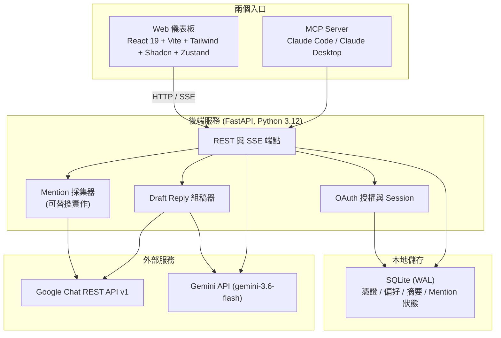
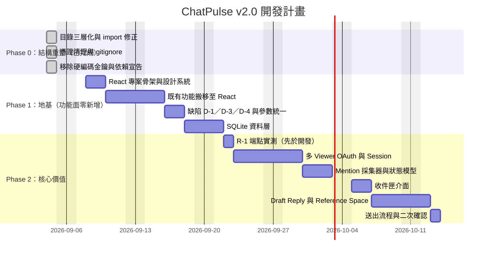

# ChatPulse 系統需求規格書

> **文件版本**：v2.0
> **修訂日期**：2026-09-04
> **前一版**：[`SPECIFICATION.v1.md`](./SPECIFICATION.v1.md)（v1.0，已封存）
> **領域語彙**：[`CONTEXT.md`](./CONTEXT.md)（本文所有粗體術語以該檔為準）
> **架構決策**：[`docs/adr/`](./docs/adr/)

---

## 〇、這一版改了什麼，以及為什麼

v1.0 是在尚未比對程式碼的情況下寫成的，它描述的系統有相當一部分不存在，也有幾處自相矛盾。v2.0 的原則是：**寫在這份文件裡的每一行，要嘛是已經存在的事實（附 `檔案:行號`），要嘛是已經決定要做的事（附階段與估時）。想法歸想法，放附錄 A，不給時程。**

v1.0 的主要問題（完整對照見附錄 B）：

| 類別 | 問題 |
| :--- | :--- |
| 虛構的技術棧 | React / Vite / Shadcn / Zustand / SQLite / DuckDB / APScheduler / AES-256 在程式碼中**零命中**，只存在於文件裡 |
| 自相矛盾 | ZPlanner 在 `v1:58`、`v1:65`、`v1:82`、`v1:120`、`v1:135` 有四種互斥的定位 |
| 事實錯誤 | `v1:131` 的 `limit` 預設 30／上限 500，官方 `pageSize` 實際是 25／1000（來源見 5.5） |
| 隱藏的架構分歧 | `v1:122` 說「Bot 送回摘要」，但讀訊息走使用者 OAuth——等於要維護兩條憑證路徑，全文從未區分 |
| 最大的遺漏 | **完全沒提到 MCP server**，而那是這個專案目前真正在運作的主體 |
| 無法驗證的宣稱 | `v1:163-164` 兩項標「已驗證」，但未說明用什麼憑證、什麼腳本驗的 |

---

## 一、專案定位與使用情境

ChatPulse 服務於一個具體場景，而不是一組泛用能力：

> **PM 在群組裡 @ 你，問一個關於專案的問題。你需要在回覆之前，先把散落在幾個群組裡的脈絡梳理清楚，然後產出一段可以直接送出的回話。**

由此延伸出三項核心能力，優先序由高到低：

1. **被 @ 了不漏接** — 跨所有 **Space** 找出誰 @ 了你，集中成一份待處理清單。
2. **回覆前先看懂脈絡** — 針對某一則 **Mention**，連同你手動指定的幾個 **Reference Space**，一起產出脈絡分析。
3. **產出可用的回話** — 生成 **Draft Reply**，你改完後以自己的身分送出。

單群組摘要（目前已能運作的功能）是上述能力的基礎，而不是終點。

---

## 二、系統現況（既有資產盤點）

改寫這份文件時實際盤點過整個 repo，程式碼與設定共 18 個檔案（不含本文件與後續新增的 `CONTEXT.md`、`docs/adr/`）。**以下功能是現在就能運作的**，規劃時不應把它們當成待開發項目：

### 2.1 MCP Server（v1.0 完全沒提到）

`mcp_app/mcp_server.py`（136 行）已註冊進 Claude Code 與 Claude Desktop，暴露四個工具：

| 工具 | 位置 | 功能 |
| :--- | :--- | :--- |
| `list_chat_spaces(search)` | `mcp_app/mcp_server.py:17` | 列出／搜尋已加入的 Space |
| `fetch_chat_messages(space, limit)` | `mcp_app/mcp_server.py:38` | 抓取指定 Space 最近訊息 |
| `summarize_chat_space(space, limit, post_to_chat)` | `mcp_app/mcp_server.py:71` | Gemini 結構化摘要，可選推播回群 |
| `send_chat_message(space, text)` | `mcp_app/mcp_server.py:115` | 發送訊息 |

**這四個工具在 v2.0 中全部保留。** 儀表板與 MCP 是同一套後端能力的兩個入口，不是替代關係。

### 2.2 後端（FastAPI，真實存在）

- `dashboard/api/server.py:21` `app = FastAPI(...)`，`:221-223` 以 uvicorn 綁 `127.0.0.1:8000`
- **SSE 串流是真的**：`dashboard/api/server.py:139-182` 的 `event_generator()` 逐行 yield `data: {...}\n\n`，上游接 Gemini 的 `:streamGenerateContent?alt=sse`（`:157`），以 `data: [DONE]` 收尾（`:180`）
- 空間列表有 5 分鐘記憶體快取（`dashboard/api/server.py:36-39`），行程內字典，重啟即失效

### 2.3 前端（單檔 HTML，**不是** React）

`dashboard/frontend/index.html`（21,599 bytes，搬移前為 `web/index.html`）為手寫單檔，無 `package.json`、無建置流程；樣式以 Tailwind CDN 引入（`dashboard/frontend/index.html:8`）——這對 Phase 1 是好消息，重寫為 React + Tailwind 時既有樣式規則可沿用，不必從零重畫。SSE 以 `fetch` + `response.body.getReader()` 消費（`:342`、`:351`、`:364`），**不是** `EventSource`——這在工程上是正確的（端點是 POST，而 `EventSource` 只支援 GET），錯的是 v1.0 的架構圖。

### 2.4 其他既有資產（v1.0 均未提及）

| 檔案 | 內容 |
| :--- | :--- |
| `mcp_app/setup_wizard.py`（119 行） | 四步安裝精靈：檢查 uv、檢查 client_secret、OAuth 授權、輸出 MCP 設定片段 |
| `mcp_app/summarizer.py`（78 行） | CLI 版單群摘要，支援 `--space` / `--count` / `--no-post` |
| `docs/index.html`（453 行） | 團隊上手指南與系統手冊 |
| `scripts/install-claude.sh` | 一鍵安裝：裝 uv → 授權 → `claude mcp add` |
| `scripts/start-web.sh` | 儀表板實際啟動方式（`uvicorn dashboard.api.server:app --port 8000 --reload`） |
| `SETUP_GUIDE.md` | MCP server 團隊上手手冊 |

---

## 三、系統架構



### 3.1 與 v1.0 架構的差異

| 元件 | v1.0 | v2.0 | 原因 |
| :--- | :--- | :--- | :--- |
| DuckDB | 核心元件 | **移除** | 其唯一用途是跨群向量檢索，已由「手動選 Reference Space」取代（ADR-0003） |
| ZPlanner | 外部整合服務 | **移除** | 四處定位互斥，且實作只是前端剪貼簿（`dashboard/frontend/index.html:433-445`） |
| Bot / Chat App | 隱含存在 | **不存在** | 全部改走使用者 OAuth（ADR-0001） |
| APScheduler | 核心元件 | **移除** | Phase 1、2 沒有任何定時需求；Mention 輪詢由後端常駐工作處理 |
| MCP Server | 未提及 | **一級入口** | 它是既有主體 |
| Mention 採集器 | 不存在 | **新增** | 核心新能力 |

### 3.2 關鍵技術決策

**後端｜FastAPI（Python 3.12）**
沿用既有實作。原生 async、內建 SSE 支援、可直接托管前端建置產物。實際執行版本為 3.12（盤點時由 `__pycache__` 中的 `*.cpython-312.pyc` 確認），非 v1.0 所寫的 3.11。

**AI｜`gemini-3.6-flash`**
與現有程式碼一致（`core/config.py:18`）。輸入上限 1,048,576 tokens（官方文件），足以吞下數百則對話。
兩點須知：(a) 官方已將其標為 previous-generation，較新的是 `gemini-3.8-flash` 與 `gemini-3.7-flash`，升級只需改 `core/config.py:18` 一行；(b) 導入期定價至 2026-12-31，2027-01-01 起改標準定價，**本文未逐項核對官方 pricing 頁**。

**儲存｜僅 SQLite（WAL 模式）**
不引入第二套資料庫。重要的是**不落地的東西**：對話全文不寫入資料庫，Mention 只存識別資訊與狀態，內容於顯示時即時向 Google Chat 取回。詳見第九節。

**前端｜React 19 + Vite + Tailwind + Shadcn + Zustand**
這是 v2.0 中唯一「規格領先實作」的部分。Phase 1 將以此重寫現有前端，功能面不增不減。建置產物交由 FastAPI 靜態托管，維持單一啟動指令。

### 3.3 專案結構

v1.0 時是單一目錄、扁平結構：MCP server 與儀表板後端同處 `src/` 底下，共用當時的 `src/api/chat_client.py`、`src/api/gemini_client.py` 與 `config/config.py`。v2.0 改為**單一 repo 內的三層結構**（ADR-0005）。**此結構已於 2026-09-04 完成搬移**，下列為現況：

```
ChatG-Bot/                    github.com/mark22013333/ChatG-Bot（private）
├── core/                     共用封裝，不含任何入口
│   ├── config.py               設定（純讀環境變數）
│   ├── chat_client.py          Google Chat API
│   └── gemini_client.py        Gemini API
├── mcp_app/                  MCP 入口——發給團隊安裝
│   ├── mcp_server.py           四個 MCP 工具
│   ├── summarizer.py           CLI 摘要
│   └── setup_wizard.py         OAuth 授權精靈
├── dashboard/                儀表板——內部使用
│   ├── api/server.py           FastAPI
│   └── frontend/               Phase 1 重寫為 React 19
├── config/                   憑證（.gitignore，不進版控）
├── docs/adr/                 架構決策
├── scripts/                  啟動與安裝腳本
├── .gitignore
└── requirements.txt
```

**依賴方向單向**：`mcp_app → core ← dashboard`，兩個入口互不 import。

#### 為什麼是 `mcp_app/` 而不是 `mcp/`

`mcp` 是 MCP SDK 自身的套件名。程式啟動時會把專案根目錄插入 `sys.path[0]`（`mcp_app/mcp_server.py:4-6`），若目錄命名為 `mcp/`，`from mcp.server.mcpserver import MCPServer` 會解析到專案自己的目錄而不是 SDK，import 直接失敗。這個坑沒有錯誤訊息會告訴你原因，只會說找不到 `MCPServer`。

`summarizer.py` 歸入 `mcp_app/`：它與 MCP 工具同樣是單人使用的入口，功能也重疊（單群摘要＋可選推播）。MCP 入口保留 `mcp_server.py` 檔名，避免與 `dashboard/api/server.py` 混淆——本文其他處出現的 `server.py` 一律指儀表板後端。

#### 為什麼共用邏輯集中在 core 而非各自複製

翻頁缺陷 D-1 這類共同瑕疵只需修一次。因為改採單一 repo，`core` 不需要獨立的發布流程與 git remote——兩個入口直接以套件路徑 import 即可，這是相對三 repo 方案最主要的節省。代價是發 MCP 給同事時，他們會一併取得儀表板的程式碼。

#### 憑證絕對不進 repo

`mcp_app/` 是要發給團隊安裝的，因此以下三項在建立版控前已一併處理，**優先於任何功能開發**：

| 項目 | 原況 | 已執行的處置 |
| :--- | :--- | :--- |
| `config/google_chat_token.json` | 明文 access + refresh token | 已列入 `.gitignore`；由執行期產生於各使用者本機 |
| `config/client_secret.json` | 明文 OAuth client secret | 已列入 `.gitignore`；由安裝精靈引導各自取得 |
| `core/config.py:17` 的 Gemini key | 硬編碼為 fallback 預設值（缺陷 D-2） | **已移除**，改為純讀 `GOOGLE_API_KEY`；缺少時由 `GeminiClient.__init__` 拋出明確錯誤 |

> 關於該金鑰是否外洩：經查證，本 repo 自建立起始終為空、從未 push，本機此前也不是 git repo，因此該金鑰**未曾離開本機**。移除硬編碼屬預防措施，是否更換金鑰由持有者自行決定。

`.gitignore` **必須列具體檔名，不可寫成 `*.json`**——那會連 React 前端必須進版控的 `package.json` 與 `package-lock.json` 一起排除掉。實際採用的內容（已建立於 repo 根）：

```gitignore
google_chat_token.json
client_secret.json
*secret*.json
token*.json
.env
__pycache__/
*.py[cod]
node_modules/
*.db
*.sqlite3
dist/
```

#### MCP 註冊路徑

`mcp_server.py` 搬家後，兩處寫死絕對路徑的設定檔必須同步更新，否則 MCP 工具下次啟動即連不上：

| 設定檔 | 原值 | 新值 |
| :--- | :--- | :--- |
| `/Users/cheng/.claude.json` | `…/src/mcp_server.py` | `…/mcp_app/mcp_server.py` |
| `~/Library/Application Support/Claude/claude_desktop_config.json` | 同上 | 同上 |

另需注意：移除硬編碼金鑰後，MCP server 依賴 `GOOGLE_API_KEY` 環境變數。Claude Code 由終端啟動時會繼承 shell 環境（該變數設於 `~/.zshrc`），但 **Claude Desktop 是 GUI 程式，不讀取 `~/.zshrc`** ——其 MCP 設定需在 `env` 區塊顯式提供該變數，否則 `GeminiClient` 會在啟動時拋錯。

---

## 四、認證與授權

v1.0 完全沒有這一章，卻在 `v1:80` 要求 SQLite 儲存「使用者偏好」——沒有使用者的定義，就沒有偏好可言。

### 4.1 授權模型

**ChatPulse 不自建權限系統。** 每位 **Viewer** 以自己的 Google 帳號授權，讀得到什麼完全由 Google 的 **Space 成員身分**決定。小明沒加入「北市府新案」，他的 token 就抓不到那個 Space——這一層隔離是免費的，不需要任何程式碼。

需要程式碼守住的只有一件事：**產出物的可見性**（第 4.3 節）。

### 4.2 OAuth Scope

以「使用者驗證」取得，三項（與 `core/config.py:10-14` 現況一致）：

| Scope | 用途 |
| :--- | :--- |
| `chat.spaces.readonly` | 列出已加入的 Space |
| `chat.messages.readonly` | 讀取訊息、搜尋 Mention |
| `chat.messages.create` | 送出 Draft Reply 與推播摘要 |

Phase 2 另需 `userinfo.profile`，用於取得 Viewer 自己的 user id（見 8.2）。

**不需要**：Marketplace 相容的 OAuth client、Workspace 管理員一次性核准、把 Bot 加進任何群組。這是 ADR-0001 的直接收益。

### 4.3 多 Viewer 與產出物可見性

- 每位 Viewer 各自跑一次 OAuth，token 各自儲存並加密（第九節）
- **Summary 私有**：只有產生者看得到，即使兩位 Viewer 在同一個 Space（ADR-0002）
- **Mention 與其狀態私有**：本來就只屬於被 @ 的那個人
- 儀表板本身的登入採 Google Sign-In，與上述 OAuth 授權同一次流程完成

---

## 五、功能規格：既有能力（Phase 1 範圍）

### 5.1 Space 查閱

- 列出 Viewer 已加入的所有 Space，支援名稱模糊搜尋
- **必須支援 100 個以上**：現行 `core/chat_client.py:28` 只取第一頁且忽略 `nextPageToken`，第 101 個之後永遠讀不到（見第十一節缺陷 D-1）
- 保留 5 分鐘快取與手動強制刷新

### 5.2 單群組摘要（SSE 串流）

- 逐字串流輸出，維持現有體驗
- **摘要風格參數必須生效**：`dashboard/api/server.py:48` 定義了 `style: str = "general"`（general／technical／action_only），但 `event_generator()` 從未讀取它。Phase 1 將其實作為 prompt 分歧（見缺陷 D-4）
- 抓取則數：預設 50，上限 1000（見 5.5）

### 5.3 Action Items 萃取

摘要中的待辦轉為可勾選項目，支援複製為 Markdown。**ZPlanner 相關功能於 v2.0 移除**，前端 `dashboard/frontend/index.html:187-188`、`:433-445` 的按鈕與 handler 一併刪除。

### 5.4 推播回 Google Chat

以 **Viewer 本人身分**送出（非 Bot）。任何送出動作都需二次確認對話框。

### 5.5 參數統一

現行程式碼的 `limit` 預設值散落 7 處、三種相異值（30／50／100 混用），且 SSE 端點無上限保護（`dashboard/api/server.py:47` 是裸 `int`，可傳 99999）。v2.0 統一為：

| 項目 | 值 | 依據 |
| :--- | :--- | :--- |
| 預設 | 50 | 沿用 `dashboard/api/server.py:83` 現值 |
| 上限 | 1000 | 對齊 Google 官方 `pageSize` 上限 |

所有入口（REST、SSE、MCP、CLI）共用同一組常數，SSE 端點補上 `Field(ge=1, le=1000)` 驗證。

> 上限依據：官方 `spaces.messages.list` 的 `pageSize` 預設 25、上限 1000（傳入超過 1000 會自動降為 1000）。
> 來源：https://developers.google.com/workspace/chat/api/reference/rest/v1/spaces.messages/list

---

## 六、功能規格：Mention 收件匣（Phase 2）

### 6.1 判定條件

一則訊息構成 **Mention**，必須**同時**滿足：

```
annotations[].type              == "USER_MENTION"
annotations[].userMention.type  == "MENTION"
annotations[].userMention.user.name == "users/{Viewer 自己的 id}"
```

> ⚠️ 只判斷 `USER_MENTION` 是錯的。`userMention.type` 另有 `ADD` 值，代表「某人被加進 Space」的系統訊息——漏掉這個條件，每次有人被拉進群都會被算成一則待回覆。

### 6.2 採集策略（可替換實作）

採集器定義為一個介面，兩種實作可互換，以避免在帳號等級未確認前就把架構賭進去：

**實作 A（首選）— 跨群搜尋**

```
POST https://chat.googleapis.com/v1/spaces/-/messages:search
{
  "filter": "annotations.user_mentions.user.name:\"users/{ID}\" AND createTime >= \"...\"",
  "orderBy": "createTime",
  "pageSize": 100
}
```

一次呼叫取得所有 Space 的 Mention。`parent` 必須是 `spaces/-`，僅支援使用者驗證。

> **風險 R-1**：官方指南的前置條件寫明需要 **Business 或 Enterprise 版 Google Workspace**。`@intumit.com` 是 Workspace 帳號，但版本等級未經確認。**Phase 2 的第一件事就是實測這個端點**，不是寫程式。

**實作 B（退路）— 逐群輪詢**

`spaces.list` → 逐 Space 呼叫 `spaces.messages.list`（帶 `filter=createTime > 上次輪詢時間`）→ 本地比對 `annotations[]`。

`spaces.messages.list` 的 `filter` 只支援 `createTime` 與 `thread.name` 兩個欄位，**沒有任何 mention 相關條件**，故過濾必須在本地做。100 個 Space 一輪約需 15~40 秒（瓶頸是每使用者 15 讀／秒的配額，非每分鐘 3,000 次）。

### 6.3 輪詢頻率

30~60 秒一次。不採用 Google Workspace Events API + Cloud Pub/Sub 的推送方案（ADR-0004）——那需要一個啟用計費的 GCP 專案，且訂閱最長 7 天即過期自動刪除，續訂失敗不會報錯、只會安靜地停止收訊。以本專案的使用情境（坐下來處理 PM 的提問），分鐘級延遲沒有實質差別。

### 6.4 狀態模型

一則 Mention 只有「待處理」與「已處理」兩種狀態。進入**已處理**的方式只有兩種：

1. Viewer 透過 ChatPulse 送出了回覆（自動標記）
2. Viewer 手動標記

> **已知取捨**：在手機或 Chat 網頁直接回覆**不會**讓它變成已處理，該則會繼續留在收件匣，直到你回來手動標記。這是刻意選擇零誤判、換取手動維護成本的結果。若日後覺得煩，替代方案是改成「Mention 之後你在該 Space 發過言即視為已處理」——但那會把「我在群裡講了別的事」也誤判為已處理。

---

## 七、功能規格：Draft Reply（Phase 2）

### 7.1 為什麼需要 Reference Space

PM 會 @ 你發問，**正是因為答案不在他看得到的地方**。若草稿產生器只讀被 @ 的那個 Space，它產出的只會是把提問者自己講過的話換句話說。

因此產生 Draft Reply 時，Viewer 可勾選 1~N 個 **Reference Space**，其近期訊息會一併納入脈絡。

### 7.2 流程

1. Viewer 在收件匣點選一則 Mention
2. 系統以 `message.thread.name` 取回該討論串完整對話
3. Viewer 勾選 Reference Space（預設不勾）與每群抓取則數
4. 送 Gemini，串流輸出兩段：**脈絡分析**（發生什麼事、關鍵決策、未解問題）與 **Draft Reply**（可直接送出的回話）
5. Viewer 於行內編輯器修改
6. 送出（需二次確認）→ 以 Viewer 身分回到原討論串 → 該 Mention 自動標記為已處理

### 7.3 不做的事

- **不自動送出。** 任何情況下系統都不會在未經確認時發話。
- **不自動選擇 Reference Space。** 跨群向量檢索（RAG）已排除於 v2.0 之外，理由見 ADR-0003。

---

## 八、API 規格

### 8.1 路徑約定的修正

Google Chat 的 space id 形如 `spaces/AAAAxLxqJxY`——**內含斜線**。v1.0 把它放在 URL path（`v1:131`、`v1:132`、`v1:134`），實作時只能靠 `{space_id:path}` 轉換器繞過（`dashboard/api/server.py:82`、`:108`），而 `publish` 端點乾脆改成放 body（`dashboard/api/server.py:194`），造成同一份 API 三種風格。

**v2.0 統一：space_id 一律不放 path。** GET 走 query string，POST 走 request body。

### 8.2 端點清單

| 方法 | 端點 | 功能 | 階段 |
| :--- | :--- | :--- | :--- |
| `GET` | `/api/v1/spaces` | Space 列表（`?search=`、`?refresh=`） | 既有 |
| `GET` | `/api/v1/messages` | 訊息列表（`?space_id=`、`?limit=`） | 既有（改路徑） |
| `POST` | `/api/v1/summarize/stream` | 單群摘要 SSE（body: `space_id`、`limit`、`style`） | 既有（改路徑） |
| `POST` | `/api/v1/publish` | 送出訊息（body: `space_id`、`text`） | 既有 |
| `GET` | `/api/v1/me` | 目前 Viewer 身分與 Google user id | Phase 2 |
| `GET` | `/api/v1/mentions` | 待處理 Mention 清單（`?state=`） | Phase 2 |
| `PATCH` | `/api/v1/mentions/{id}` | 標記狀態（body: `state`） | Phase 2 |
| `POST` | `/api/v1/mentions/{id}/draft/stream` | 產生 Draft Reply SSE（body: `reference_space_ids[]`、`limit`） | Phase 2 |
| `GET` | `/api/v1/summaries` | 本人的歷史 Summary | Phase 2 |

`cardsV2` 於 v2.0 移除（v1:134 曾列出，實作從未支援，且純文字已足夠）。

### 8.3 SSE 事件格式（v1.0 完全未定義）

所有串流端點共用同一組事件。每個 frame 為單行 JSON：

```
data: {"type":"meta","space":"1.BU2-PG","message_count":50}

data: {"type":"chunk","text":"本週討論集中在"}

data: {"type":"chunk","text":"WAF 攔截問題…"}

data: {"type":"done"}
```

錯誤以事件傳遞，**不中斷連線**（HTTP 200 已送出，無法再改狀態碼）：

```
data: {"type":"error","code":"GEMINI_QUOTA_EXCEEDED","message":"Gemini 配額已用盡"}
```

- 前端以 `fetch` + `body.getReader()` 消費（非 `EventSource`，因端點為 POST）
- 回應標頭固定含 `Cache-Control: no-cache` 與 `X-Accel-Buffering: no`（沿用 `dashboard/api/server.py:184-192`）
- 收到 `type:"done"` 或 `type:"error"` 後關閉讀取

### 8.4 錯誤規格（v1.0 完全未定義）

非串流端點統一回：

```json
{ "error": { "code": "SPACE_NOT_FOUND", "message": "找不到指定的聊天室" } }
```

| HTTP | code | 情境 |
| :--- | :--- | :--- |
| 400 | `INVALID_PARAMETER` | 參數格式錯誤、limit 超出 1~1000 |
| 401 | `NOT_AUTHENTICATED` | 未登入或 session 過期 |
| 403 | `SPACE_FORBIDDEN` | Viewer 不是該 Space 成員 |
| 404 | `SPACE_NOT_FOUND` / `MENTION_NOT_FOUND` | 目標不存在 |
| 429 | `CHAT_RATE_LIMITED` / `GEMINI_QUOTA_EXCEEDED` | 上游限流，回應帶 `Retry-After` |
| 502 | `CHAT_API_ERROR` / `GEMINI_API_ERROR` | 上游非預期回應 |

Google Chat 回 429 時採指數退避重試，最多 3 次；仍失敗才向前端拋出。

---

## 九、資料模型

SQLite（WAL 模式），單一檔案。**對話全文不落地。**

| 資料表 | 欄位重點 | 保留策略 |
| :--- | :--- | :--- |
| `viewers` | `id`、`google_user_id`、`email`、`display_name` | 永久 |
| `credentials` | `viewer_id`、`encrypted_token`、`expiry` | 隨帳號 |
| `preferences` | `viewer_id`、`pinned_space_ids`、`default_limit`、`default_style` | 永久 |
| `summaries` | `id`、**`owner_viewer_id`**、`space_id`、`content_md`、`created_at` | 90 天後清除 |
| `mentions` | `id`、`viewer_id`、`space_id`、`message_name`、`thread_name`、`create_time`、`state`、`resolved_at` | 90 天後清除 |
| `draft_replies` | `id`、`mention_id`、`content_md`、`sent_at` | 隨 mention |

**設計要點**

- `summaries` 的每一次查詢都必須帶 `WHERE owner_viewer_id = <當前 Viewer>`。這是 ADR-0002 的唯一執行點，漏一次就等於全開。
- `mentions` **只存識別資訊**（message name、thread name、時間），不存訊息內容。收件匣顯示時即時向 Google Chat 取回。好處有二：落地的公司對話量降到最低；訊息在 Chat 被編輯或刪除時，儀表板不會顯示過期內容。
- `credentials.encrypted_token` 以本機金鑰加密。金鑰不與資料庫同檔存放。這才是 v1.0 那個 `TokenVault`（`v1:47`）該有的樣子——現況是明文 JSON（`config/google_chat_token.json`），見缺陷 D-5。

---

## 十、資料處理邊界與已知風險承擔

本節是刻意寫的，因為它涉及的是別人的資料，而決定已經做出。

### 10.1 資料流向

| 資料 | 去哪裡 | 是否落地 |
| :--- | :--- | :--- |
| Space 名稱與清單 | 本機 | 是（快取／偏好） |
| 對話訊息內容 | 本機記憶體 → **Google Gemini API** | **否** |
| Gemini 產生的摘要與草稿 | 本機 | 是（90 天） |
| OAuth token | 本機 | 是（加密） |

### 10.2 已知風險與承擔

**已決定：不設 Space 排除清單。** 所有 Viewer 有權讀取的 Space，都可以送 Gemini 產生摘要與草稿，**包含公部門與金融客戶專案群組**。

具體意義：

1. 這些群組的原始對話內容會離開公司環境，送至 Google Gemini API。
2. 使用個人 API key 呼叫 Gemini API，其資料處理條款與公司既有的 Google Workspace 合約**不是同一份**。「反正公司已經用 Google」不構成本項的正當性。
3. 摘要與草稿會以明文存在本機 SQLite 中 90 天。
4. 團隊共用之後，這不再只是單一 Viewer 的個人決定。

**若日後需要收緊**，成本最低的做法是在 `preferences` 旁增設 `excluded_space_ids`，UI 上把被排除 Space 的摘要與草稿按鈕置灰。這是約半天的工作——但已經送出去的資料收不回來。

**替代路徑**：改接公司 GCP 專案下的 Vertex AI（企業合約、資料不進訓練、可選區域），程式碼改動限於 `gemini_client.py` 的認證與 endpoint。

---

## 十一、已知缺陷（現在就是壞的）

以下四項與規格無關，是現行程式碼的實際問題，全部排入 Phase 1。

| ID | 位置 | 問題 | 後果 |
| :--- | :--- | :--- | :--- |
| **D-1** | `core/chat_client.py:28` | `spaces().list(pageSize=100)` 未處理 `nextPageToken`（同檔 `:47-61` 的訊息抓取有寫翻頁迴圈） | 加入第 101 個 Space 之後永遠讀不到。直接推翻 v1.0 講了四次的「100+ 群組」（`v1:11`、`v1:75`、`v1:97`、`v1:112`） |
| **D-2** | `core/config.py:17` | Gemini API key 以明文硬編碼為環境變數的 fallback 預設值 | repo 要交給團隊使用，等於把金鑰一併發出。**該金鑰應視為已洩漏，立即作廢重發，不要等 Phase 1 改完程式碼**。修法：讀不到 `GOOGLE_API_KEY` 就啟動失敗，不提供內建值 |
| **D-3** | `core/gemini_client.py:50`、`dashboard/api/server.py:162` | `maxOutputTokens: 2048` | 500 則對話的結構化摘要會被截斷。v1.0 拿「100 萬 token 輸入窗口」當賣點（`v1:76-77`），但輸入窗口大與輸出夠用是兩件事。調整為 16384 |
| **D-4** | `dashboard/api/server.py:48` | `SummarizeRequest.style` 定義後從未被讀取 | UI 有下拉選單、API 有欄位、行為不存在。Phase 1 實作為 prompt 分歧 |
| **D-5** | `config/google_chat_token.json`、`config/client_secret.json` | OAuth token（access + refresh）與 client secret 皆以明文 JSON 存放於檔案系統 | 拆分後 MCP repo 要發給團隊，這兩個檔一旦進版控等同交出帳號授權。Phase 1 列入 `.gitignore`；Phase 2 隨多 Viewer 支援改存 `credentials` 表並加密（第九節） |

另有一項非缺陷但需補齊：**專案沒有任何依賴宣告檔**（無 `requirements.txt`／`pyproject.toml`／`Pipfile`）。Phase 1 補上。

---

## 十二、待實測風險

| ID | 風險 | 影響 | 處置 |
| :--- | :--- | :--- | :--- |
| **R-1** | `spaces.messages.search` 需要 Business/Enterprise 版 Workspace，`@intumit.com` 的版本等級未確認 | 決定 Mention 採集走實作 A 或 B | **Phase 2 第一個工作項**就是實測，不先寫程式。退路已備妥（6.2 實作 B），最壞情況是一輪 15~40 秒而非單次呼叫 |
| **R-2** | `gemini-3.6-flash` 的實際計費與導入期定價（至 2026-12-31）未逐項核對 | 團隊共用後成本可能高於預期 | Phase 1 加入每日 token 用量記錄，累積兩週後再評估 |
| **R-3** | v1.0 `v1:163-164` 標「已驗證」的兩項未附證據 | 見下方澄清 | 已於本版如實重寫 |

**關於「已驗證」的澄清**（取代 `v1:163-164` 的無憑打勾）：

- **Google Chat 憑證與空間讀取**：有實證。`config/google_chat_token.json` 存在真實取得過的 token（scope 與 `config.py:10-14` 逐字相符），且 `mcp_server.py` 已註冊為 MCP server 並在實際 session 中連線成功、四個工具名稱一一對應。
- **Gemini 長文本摘要邏輯**：程式碼結構完整（`core/gemini_client.py:16-63` 含 system instruction、prompt 組裝、generationConfig、錯誤處理、回應解析），**但沒有實際 API 呼叫紀錄可佐證它跑得起來**。狀態應記為「已實作，未實跑驗證」。

---

## 十三、實施計畫



### 階段目標與驗收

**Phase 0（已完成，2026-09-04）— 結構重整**

- [x] 目錄改為 `core` / `mcp_app` / `dashboard` 三層，依賴方向單向
- [x] 所有 import 與 `BASE_DIR` 層數修正，四個模組實測可 import
- [x] shell scripts 路徑更新（`install-claude.sh`、`setup.sh`、`run_summary.sh`、`start-web.sh`）
- [x] `.gitignore` 建立，憑證檔排除且未誤排除 `package.json`（D-5 之版控面）
- [x] `core/config.py:17` 硬編碼金鑰移除，改為缺少即拋錯（D-2）
- [x] `requirements.txt` 建立
- [ ] MCP 註冊路徑更新，`mcp__google-chat__*` 四個工具在新路徑下仍可連線

**Phase 1（約 2 週）— 地基**

功能面**零新增**。結束時你手上的東西和現在幾乎一樣，差別在底下換過了。這個取捨是刻意的：既然確定要重寫前端，先重寫再加新功能，新功能只需實作一次。

驗收條件：
- [ ] React 版可完成現有全部操作（列 Space、摘要串流、Action Items、推播）
- [ ] 加入超過 100 個 Space 時，第 101 個之後仍讀得到（D-1）
- [ ] 500 則對話的摘要不被截斷（D-3）
- [ ] 切換摘要風格會產生不同結果（D-4）
- [ ] `limit` 傳 0、1001、非數值時回 400 `INVALID_PARAMETER`，四個入口行為一致（5.5）
- [ ] SQLite schema 已建立，`summaries` 與 `preferences` 可寫入並讀回，重啟後資料仍在
- [ ] `pip install -r requirements.txt` 可在乾淨環境重建（屆時應鎖定版本）

**Phase 2（約 3 週）— 核心價值**

你真正要的功能在這裡。

驗收條件：
- [ ] R-1 已實測，採集器實作 A 或 B 之一確定可用
- [ ] 兩位 Viewer 各自登入，各自只看到自己的 Space 與 Summary
- [ ] 有人 @ 你之後 60 秒內出現在收件匣
- [ ] 「某人被加進群組」不會被誤判為 Mention
- [ ] Draft Reply 能引用 Reference Space 的內容（測法：答案只存在於參考群組，被 @ 的群組裡沒有）
- [ ] 送出需二次確認，送出後該 Mention 自動標記已處理
- [ ] 送出的訊息在 Chat 中顯示為 Viewer 本人，且落在原討論串

### 估時的但書

上列為工作日估算，不含行政等待與需求變更。Phase 1 的 4 天「既有功能搬移」是整份計畫中最不確定的一項——SSE 串流解析在現有實作中已經調校過（`dashboard/frontend/index.html:342-364`），搬到 React 需要重新處理一次串流狀態與 unmount 清理。

---

## 十四、MoSCoW

**Must Have（Phase 1）**
- [x] Google Chat 憑證與 Space 讀取（有實證，見第十二節）
- [x] MCP server 四工具（`mcp_app/mcp_server.py:17`、`:38`、`:71`、`:115`）
- [x] Gemini 摘要邏輯與 SSE 串流（已實作，未實跑驗證）
- [ ] React 儀表板（重寫既有功能）
- [ ] 缺陷 D-1 ~ D-4 修復
- [ ] SQLite 資料層與依賴宣告

**Must Have（Phase 2）**
- [ ] 多 Viewer OAuth 與 Session
- [ ] Mention 收件匣（採集、狀態、介面）
- [ ] Draft Reply 與 Reference Space
- [ ] 以 Viewer 身分送出，含二次確認

**Won't Have（v2.0 明確不做）**
- 自動發言：任何未經 Viewer 確認的訊息送出
- Chat App / Bot 架構（ADR-0001）
- 跨群向量檢索 RAG（ADR-0003）
- ZPlanner 整合
- 定時排程自動摘要
- 員工發言量統計與考核

---

## 附錄 A：未規劃的衍生想法

> **以下全部沒有時程、沒有承諾、不在任何 Phase 內。** 保留是因為它們是當初啟動這個專案的動機，值得記著。要動其中任何一項，需先回到規格書走一次完整規劃。

| 想法 | 痛點 | 前置依賴 |
| :--- | :--- | :--- |
| 跨群週報產生器 | 每週五手動拼湊十幾個專案群組的進度 | 多群組聯合摘要端點 |
| 跨群技術踩坑 RAG 智庫 | 某專案解決過的問題，另一專案重新踩 | 對話全文落地 + embedding 成本 + 索引維護（ADR-0003 說明為何暫不做） |
| Blocker 預警雷達 | 卡關數天，主管在死線前才得知 | 定時巡檢 + 預警投遞管道（未定義） |
| 交接脈絡速成包 | 新人面對數千則歷史訊息 | 長區間歷史抓取 + 成本評估 |
| Incident 戰情時間線 | 事故後難以還原排查順序 | 跨群時序重組 |

原始描述保留於 [`SPECIFICATION.v1.md`](./SPECIFICATION.v1.md) 第 20~30 行。

---

## 附錄 B：v1.0 → v2.0 變更對照

| v1.0 位置 | 原內容 | v2.0 處置 |
| :--- | :--- | :--- |
| `v1:4` | 作者「Antigravity Multi-Agent Architecture Team」 | 移除（非真實團隊） |
| `v1:24-30` | 五大衍生應用場景（含 Gantt 時程） | 移至附錄 A，不給時程 |
| `v1:39` | React 19 + Vite + Tailwind + Shadcn | 從虛構改為 Phase 1 計畫 |
| `v1:40` | SSE `EventSource` | 修正為 `fetch` + `getReader()`（POST 端點無法用 EventSource） |
| `v1:46` | APScheduler | 移除（無定時需求） |
| `v1:47` | TokenVault（AES-256） | 保留概念，落實到 `credentials` 表；現況明文列為缺陷 D-5 |
| `v1:52`、`v1:81` | DuckDB 向量檢索 | 移除（ADR-0003）。另 `v1:81` 有錯字「高性能力量分析引擎」 |
| `v1:58`、`:65`、`:82`、`:120`、`:135`、`:170` | ZPlanner（四種互斥定位） | 全數移除 |
| `v1:76-77` | 「100 萬 Token 上下文」 | 保留（查證屬實），但補上輸出上限 2048 的缺陷 D-3 |
| `v1:91` | 三欄式工作台 | 實際只有兩欄；UI 規格於 Phase 1 重新設計 |
| `v1:100-101` | 群組健康度與熱力圖 | 移除（無對應 API、無對應階段，畫在圖裡但無人要做） |
| `v1:110` | 章節編號從「1.」跳到「4.3」 | 修正 |
| `v1:122` | 「Bot 自動將摘要送回」 | 改為 Viewer 身分送出（ADR-0001） |
| `v1:131` | limit 預設 30、上限 500 | 修正為 50 / 1000（官方 `pageSize` 為 25 / 1000，來源見 5.5） |
| `v1:132`、`:134` | space_id 置於 URL path | 改為 query / body（space id 內含斜線） |
| `v1:134` | `cardsV2` | 移除（從未實作，純文字已足夠） |
| `v1:136` | `/api/v1/schedules` 僅 GET/POST | 整項移除（無排程需求） |
| `v1:163-164` | 兩項標「已驗證」無證據 | 改為如實標注，見第十二節 |
| — | MCP server、setup_wizard、docs/、scripts/、SETUP_GUIDE.md | **新增**（v1.0 完全未提及） |
| — | 認證與授權、SSE 事件格式、錯誤規格、資料模型、資料處理邊界 | **新增**（v1.0 完全沒有這些章節） |
| — | 專案結構與 repo 拆分（3.3） | **新增**——v1.0 未描述任何目錄結構，MCP 與儀表板混在 `src/` 底下 |
