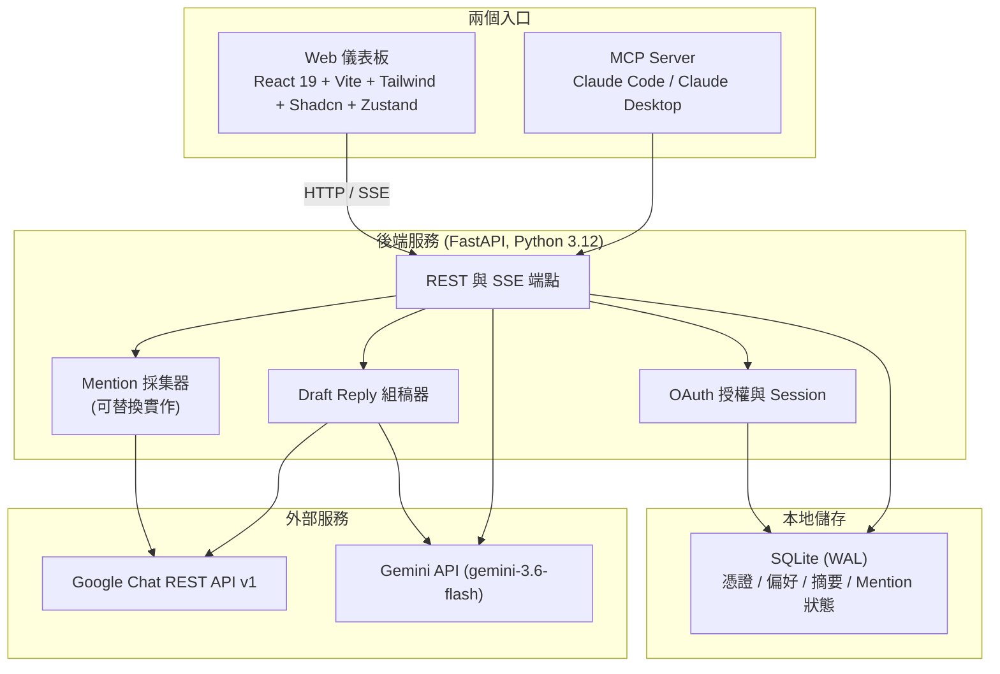
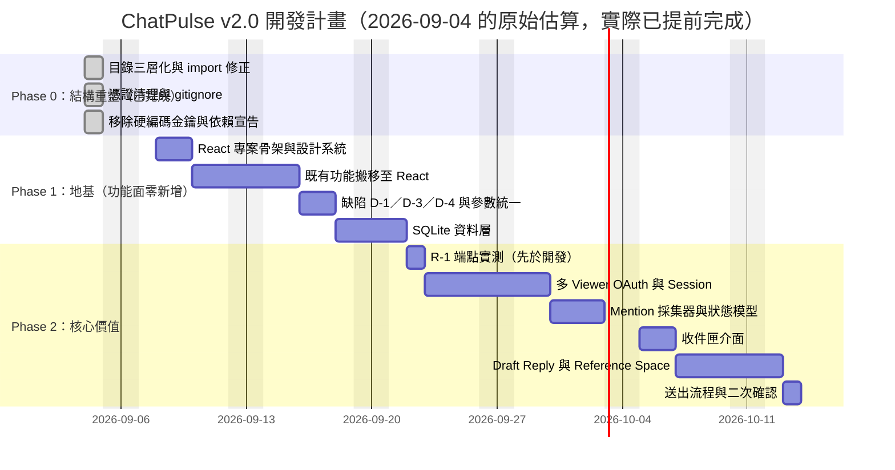

# ChatPulse 系統需求規格書

> **文件版本**：v2.0
> **修訂日期**：2026-09-04
> **前一版**：[`SPECIFICATION.v1.md`](./SPECIFICATION.v1.md)（v1.0，已封存）
> **領域語彙**：[`CONTEXT.md`](./CONTEXT.md)（本文所有粗體術語以該檔為準）
> **架構決策**：[`docs/adr/`](./docs/adr/)
>
> **關於本文的 `檔案:行號` 錨點**：v2.0 撰寫時（2026-09-04）以行號標注每個事實的位置，
> 那是刻意的——它讓「這句話有沒有依據」變成可查的事。但 Phase 0／1／2 的實作
> （2026-09-05）改寫了 `core/`、`dashboard/`、`mcp_app/` 的多數檔案，**第二節與各缺陷
> 表格裡的行號多已失效**。
>
> 處理原則：**描述「當時盤點到什麼」的錨點原樣保留**（那是歷史紀錄，改成現在的行號會
> 讓它變成假的）；**描述「現在如何運作」的地方改為只指檔案與符號名**，因為行號一定會再漂。
> 要找當前位置請用符號名 grep，不要照行號跳。

---

## 〇、這一版改了什麼，以及為什麼

v1.0 是在尚未比對程式碼的情況下寫成的，它描述的系統有相當一部分不存在，也有幾處自相矛盾。v2.0 的原則是：**寫在這份文件裡的每一行，要嘛是已經存在的事實（附 `檔案:行號`），要嘛是已經決定要做的事（附階段與估時）。想法歸想法，放附錄 A，不給時程。**

v1.0 的主要問題（完整對照見附錄 B）：

| 類別 | 問題 |
| :--- | :--- |
| 虛構的技術棧 | React / Vite / Shadcn / Zustand / SQLite / DuckDB / APScheduler / AES-256 在程式碼中**零命中**，只存在於文件裡 |
| 自相矛盾 | ZPlanner 在 `v1:58`、`v1:65`、`v1:82`、`v1:120`、`v1:135` 有四種互斥的定位 |
| 事實錯誤 | `v1:131` 的 `limit` 預設 30／上限 500，官方 `pageSize` 實際是 25／1000（來源見 5.5） |
| 隱藏的架構分歧 | `v1:122` 說「Bot 送回摘要」，但讀訊息走使用者 OAuth——等於要維護兩條憑證路徑，全文從未區分 |
| 最大的遺漏 | **完全沒提到 MCP server**，而那是這個專案目前真正在運作的主體 |
| 無法驗證的宣稱 | `v1:163-164` 兩項標「已驗證」，但未說明用什麼憑證、什麼腳本驗的 |

---

## 一、專案定位與使用情境

ChatPulse 服務於一個具體場景，而不是一組泛用能力：

> **PM 在群組裡 @ 你，問一個關於專案的問題。你需要在回覆之前，先把散落在幾個群組裡的脈絡梳理清楚，然後產出一段可以直接送出的回話。**

由此延伸出三項核心能力，優先序由高到低：

1. **被 @ 了不漏接** — 跨所有 **Space** 找出誰 @ 了你，集中成一份待處理清單。
2. **回覆前先看懂脈絡** — 針對某一則 **Mention**，連同你手動指定的幾個 **Reference Space**，一起產出脈絡分析。
3. **產出可用的回話** — 生成 **Draft Reply**，你改完後以自己的身分送出。

單群組摘要（目前已能運作的功能）是上述能力的基礎，而不是終點。

---

## 二、系統現況（既有資產盤點）

> ⚠️ **本節是 2026-09-04 的快照，不是現況。** Phase 0／1／2 已於 2026-09-05 完成，
> 本節所有行號與行數都指向改寫前的檔案。保留它的理由是「當初從什麼狀態出發」本身
> 就是規格的一部分——第三節之後的每個決策都是相對這個起點做的。現況請看第十三節的驗收條件。

改寫這份文件時實際盤點過整個 repo，程式碼與設定共 18 個檔案（不含本文件與後續新增的 `CONTEXT.md`、`docs/adr/`）。**以下功能是現在就能運作的**，規劃時不應把它們當成待開發項目：

### 2.1 MCP Server（v1.0 完全沒提到）

`mcp_app/mcp_server.py`（136 行）已註冊進 Claude Code 與 Claude Desktop，暴露四個工具：

| 工具 | 位置 | 功能 |
| :--- | :--- | :--- |
| `list_chat_spaces(search)` | `mcp_app/mcp_server.py:17` | 列出／搜尋已加入的 Space |
| `fetch_chat_messages(space, limit)` | `mcp_app/mcp_server.py:38` | 抓取指定 Space 最近訊息 |
| `summarize_chat_space(space, limit, post_to_chat)` | `mcp_app/mcp_server.py:71` | Gemini 結構化摘要，可選推播回群 |
| `send_chat_message(space, text)` | `mcp_app/mcp_server.py:115` | 發送訊息 |

**這四個工具在 v2.0 中全部保留。** 儀表板與 MCP 是同一套後端能力的兩個入口，不是替代關係。

### 2.2 後端（FastAPI，真實存在）

- `dashboard/api/server.py:21` `app = FastAPI(...)`，`:221-223` 以 uvicorn 綁 `127.0.0.1:8000`
- **SSE 串流是真的**：`dashboard/api/server.py:139-182` 的 `event_generator()` 逐行 yield `data: {...}\n\n`，上游接 Gemini 的 `:streamGenerateContent?alt=sse`（`:157`），以 `data: [DONE]` 收尾（`:180`）
- 空間列表有 5 分鐘記憶體快取（`dashboard/api/server.py:36-39`），行程內字典，重啟即失效

### 2.3 前端（2026-09-04 當時是單檔 HTML，**不是** React；Phase 1 已重寫，見 3.2）

`dashboard/frontend/index.html`（盤點時 21,599 bytes、493 行，搬移前為 `web/index.html`）為手寫單檔，無 `package.json`、無建置流程；樣式以 Tailwind CDN 引入——這對 Phase 1 是好消息，重寫為 React + Tailwind 時既有樣式規則可沿用，不必從零重畫。SSE 以 `fetch` + `response.body.getReader()` 消費，**不是** `EventSource`——這在工程上是正確的（端點是 POST，而 `EventSource` 只支援 GET），錯的是 v1.0 的架構圖。

> Phase 1 的 React 重寫把 `dashboard/frontend/index.html` 覆蓋成 Vite 的開發入口
> （只剩十幾行），所以本小節原有的行號引用已一併移除——單檔版的內容可從 git 歷史取回。

### 2.4 其他既有資產（v1.0 均未提及）

| 檔案 | 內容 |
| :--- | :--- |
| `mcp_app/setup_wizard.py`（119 行） | 四步安裝精靈：檢查 uv、檢查 client_secret、OAuth 授權、輸出 MCP 設定片段 |
| `mcp_app/summarizer.py`（78 行） | CLI 版單群摘要，支援 `--space` / `--count` / `--no-post` |
| `docs/index.html`（453 行） | 團隊上手指南與系統手冊 |
| `scripts/install-claude.sh` | 一鍵安裝：裝 uv → 授權 → `claude mcp add` |
| `scripts/start-web.sh` | 儀表板實際啟動方式（`uvicorn dashboard.api.server:app --port 8000 --reload`） |
| `SETUP_GUIDE.md` | MCP server 團隊上手手冊 |

---

## 三、系統架構



### 3.1 與 v1.0 架構的差異

| 元件 | v1.0 | v2.0 | 原因 |
| :--- | :--- | :--- | :--- |
| DuckDB | 核心元件 | **移除** | 其唯一用途是跨群向量檢索，已由「手動選 Reference Space」取代（ADR-0003） |
| ZPlanner | 外部整合服務 | **移除** | 四處定位互斥，且實作只是前端剪貼簿（單檔前端裡的一段 handler，已隨 Phase 1 重寫消失） |
| Bot / Chat App | 隱含存在 | **不存在** | 全部改走使用者 OAuth（ADR-0001） |
| APScheduler | 核心元件 | **移除** | Phase 1、2 沒有任何定時需求；Mention 輪詢由後端常駐工作處理 |
| MCP Server | 未提及 | **一級入口** | 它是既有主體 |
| Mention 採集器 | 不存在 | **新增** | 核心新能力 |

### 3.2 關鍵技術決策

**後端｜FastAPI（Python 3.12）**
沿用既有實作。原生 async、內建 SSE 支援、可直接托管前端建置產物。實際執行版本為 3.12（盤點時由 `__pycache__` 中的 `*.cpython-312.pyc` 確認），非 v1.0 所寫的 3.11。

**AI｜供應商可選，預設 Claude（2026-09-05 新增）**

原本寫死 Gemini。R-4 實測 Gemini 免費層每天只有 20 次請求後，AI 供應商改為
**可切換的介面**（`core/providers/`），兩個實作：

| 供應商 | 需要什麼 | 適用 |
| :--- | :--- | :--- |
| `claude_cli` | 本機裝好並登入 Claude Code | 吃現有訂閱、零額外設定，開發與單人使用 |
| `gemini` | `GOOGLE_API_KEY` | 既有選項，免費層每天 20 次 |

另有兩個**別名**：`claude`（目前解析為 `claude_cli`）與 `auto`（依序試
`claude_cli` → `gemini`，挑第一個現在可用的）。`CHATPULSE_AI_PROVIDER` 預設 `claude`。
單次請求可用 body 的 `provider` 欄位覆寫，Viewer 也可存成偏好（`default_provider`）。

介面刻意很窄，只有「產生文字」與「串流產生文字」兩件事——摘要與 Draft Reply
都不需要工具呼叫或多輪對話，介面開大只會讓實作互相遷就。

> **`claude_api`（Anthropic API）供應商已於 2026-09-05 移除。**
> 它在 2026-09-05 稍早隨這一節一起加入，但**從頭到尾沒有對真實 API 跑過**——
> 這台機器既沒有 `ANTHROPIC_API_KEY` 也沒有 `ant` CLI，驗到的只有「模組匯入得了」
> 與「參數組得起來」。留著它的代價是具體的：`GET /api/v1/providers` 會回一個
> 永遠 `available: false` 的選項、前端下拉選單多一格沒人驗過的路徑、
> `requirements.txt` 多一個只有它會用到的 `anthropic` 套件。
> 決定是拿掉而不是留著等有金鑰再驗——**未驗證的分支不該出現在契約裡**。
>
> 連帶移除：`core/providers/claude_api.py`、`ANTHROPIC_API_KEY`／
> `CHATPULSE_CLAUDE_API_MODEL`／`CHATPULSE_CLAUDE_API_EFFORT` 三個設定、
> `anthropic` 套件依賴。**錯誤碼 `CLAUDE_API_ERROR` 與 `CLAUDE_QUOTA_EXCEEDED` 保留**——
> `claude_cli` 也在用它們（見 `core/providers/claude_cli.py` 的 `_classify`）。
> 實作本身留在 git 歷史裡，要接回來不必重寫。

> **Claude Code CLI 的實測注意事項**：預設會載入 Claude Code 自己的 system prompt、
> CLAUDE.md 與全部工具定義，一個 2-token 的 prompt 也會寫入 **19,085 token** 的快取
> （約 $0.077）。停掉工具與 MCP、並用 `--system-prompt` 取代預設之後，同一個請求降到
> **0 token 快取寫入、約 $0.0006**。實作已固定帶上這些參數。
> 另外**刻意不用 `--bare`**：它雖然能跳過 CLAUDE.md，但同時規定只讀 `ANTHROPIC_API_KEY`
> 而不讀 OAuth——那會毀掉這條路徑「用現有訂閱」的唯一優點。

**Gemini 的細節（保留為可選供應商）｜`gemini-3.6-flash`**
與現有程式碼一致（`core/config.py` 的 `GEMINI_MODEL`）。輸入上限 1,048,576 tokens（官方文件），足以吞下數百則對話。
兩點須知：(a) 官方已將其標為 previous-generation，較新的是 `gemini-3.8-flash` 與 `gemini-3.7-flash`，升級只需改 `core/config.py` 的 `GEMINI_MODEL` 一行，或直接設 `CHATPULSE_GEMINI_MODEL` 環境變數；(b) 導入期定價至 2026-12-31，2027-01-01 起改標準定價，**本文未逐項核對官方 pricing 頁**。

**儲存｜僅 SQLite（WAL 模式）**
不引入第二套資料庫。重要的是**不落地的東西**：對話全文不寫入資料庫，Mention 只存識別資訊與狀態，內容於顯示時即時向 Google Chat 取回。詳見第九節。

**前端｜React 19 + Vite + Tailwind + Shadcn + Zustand**
這原是 v2.0 中唯一「規格領先實作」的部分。**2026-09-05 已完成**：`dashboard/frontend/` 為 React 19 + TypeScript + Vite 8 + Tailwind v4（`@tailwindcss/vite` plugin，非 CDN）+ Shadcn 元件 + Zustand（auth／spaces／summary／mentions／draft 五個 store），共 46 個原始檔。建置產物 `dist/` 交由 FastAPI 靜態托管（`/assets` 掛載 ＋ SPA fallback），維持單一啟動指令。436 個 Space 以虛擬滾動處理。

> 一併補上 v2.0 原本沒定義的兩份文件：[`docs/api-contract.md`](./docs/api-contract.md)（前後端的 API 契約，含 SSE 事件與錯誤碼對照）與 [`docs/R1-findings.md`](./docs/R1-findings.md)（R-1 實測報告）。E2E 測試在 `tests/e2e/`，用 `run_all.py` 一次跑完五套。

### 3.3 專案結構

v1.0 時是單一目錄、扁平結構：MCP server 與儀表板後端同處 `src/` 底下，共用當時的 `src/api/chat_client.py`、`src/api/gemini_client.py` 與 `config/config.py`。v2.0 改為**單一 repo 內的三層結構**（ADR-0005）。**此結構已於 2026-09-04 完成搬移**，下列為現況：

```
ChatPulse/                    github.com/mark22013333/ChatPulse（private）
├── core/                     共用封裝，不含任何入口
│   ├── config.py               設定（純讀環境變數）
│   ├── chat_client.py          Google Chat API
│   └── gemini_client.py        Gemini API
├── mcp_app/                  MCP 入口——發給團隊安裝
│   ├── mcp_server.py           四個 MCP 工具
│   ├── summarizer.py           CLI 摘要
│   └── setup_wizard.py         OAuth 授權精靈
├── dashboard/                儀表板——內部使用
│   ├── api/server.py           FastAPI
│   └── frontend/               React 19 + Vite（Phase 1 已重寫，產物在 dist/）
├── config/                   憑證（.gitignore，不進版控）
├── docs/adr/                 架構決策
├── scripts/                  啟動與安裝腳本
├── .gitignore
└── requirements.txt
```

**依賴方向單向**：`mcp_app → core ← dashboard`，兩個入口互不 import。

#### 為什麼是 `mcp_app/` 而不是 `mcp/`

`mcp` 是 MCP SDK 自身的套件名。程式啟動時會把專案根目錄插入 `sys.path[0]`（見 `mcp_app/mcp_server.py` 開頭的 `BASE_DIR` 那幾行），若目錄命名為 `mcp/`，`from mcp.server.mcpserver import MCPServer` 會解析到專案自己的目錄而不是 SDK，import 直接失敗。這個坑沒有錯誤訊息會告訴你原因，只會說找不到 `MCPServer`。

`summarizer.py` 歸入 `mcp_app/`：它與 MCP 工具同樣是單人使用的入口，功能也重疊（單群摘要＋可選推播）。MCP 入口保留 `mcp_server.py` 檔名，避免與 `dashboard/api/server.py` 混淆——本文其他處出現的 `server.py` 一律指儀表板後端。

#### 為什麼共用邏輯集中在 core 而非各自複製

翻頁缺陷 D-1 這類共同瑕疵只需修一次。因為改採單一 repo，`core` 不需要獨立的發布流程與 git remote——兩個入口直接以套件路徑 import 即可，這是相對三 repo 方案最主要的節省。代價是發 MCP 給同事時，他們會一併取得儀表板的程式碼。

#### 憑證絕對不進 repo

`mcp_app/` 是要發給團隊安裝的，因此以下三項在建立版控前已一併處理，**優先於任何功能開發**：

| 項目 | 原況 | 已執行的處置 |
| :--- | :--- | :--- |
| `config/google_chat_token.json` | 明文 access + refresh token | 已列入 `.gitignore`；由執行期產生於各使用者本機 |
| `config/client_secret.json` | 明文 OAuth client secret | 已列入 `.gitignore`；由安裝精靈引導各自取得 |
| `core/config.py:17` 的 Gemini key | 硬編碼為 fallback 預設值（缺陷 D-2） | **已移除**，改為純讀 `GOOGLE_API_KEY`；缺少時由 `GeminiClient.__init__` 拋出明確錯誤 |

> **關於該金鑰是否外洩（2026-09-05 收斂結論，取代原本兩處互斥的說法）**
>
> v2.0 原文在兩個地方給了相反的建議：這裡寫「未曾離開本機、換不換隨你」，
> 十一節 D-2 卻寫「應視為已洩漏、立即作廢重發」。讀者無法判斷該不該換金鑰，
> 而這是唯一有實際後果的一句，所以在此收斂：
>
> **建議更換**，理由是這把金鑰目前散佈在本機的多個位置，且其中兩處不受本 repo 控制：
> 1. `~/.claude.json` 與 `~/Library/Application Support/Claude/claude_desktop_config.json`
>    的 MCP `env` 區塊裡是**明文**（Claude Desktop 是 GUI 程式、不讀 `~/.zshrc`，所以這是必要的）。
> 2. 2026-09-05 發現的一個實際洩漏管道：`gemini_client.py` 原本把金鑰放在
>    `?key=` query string，於是任何含 URL 的錯誤訊息都會把它整把印出來——
>    當天 D-3 測試撞到 429 時，`raise_for_status()` 就把金鑰印在終端上，
>    也就進了 shell 歷史與這次 session 的紀錄。**該寫法已改為 `x-goog-api-key` 標頭**，
>    但已經印出去的那幾次收不回來。
>
> 「repo 從未 push」這件事仍為真——**金鑰沒有離開這台機器**，所以這不是緊急事故。
> 但既然它已經進過終端輸出，成本最低的處置就是換一把；換金鑰只需改上述兩個設定檔
> 與 shell 環境變數，不需要動程式碼。

`.gitignore` **必須列具體檔名，不可寫成 `*.json`**——那會連 React 前端必須進版控的 `package.json` 與 `package-lock.json` 一起排除掉。實際採用的內容（已建立於 repo 根）：

下列為 repo 根 `.gitignore` 的**憑證與本機資料**相關條目（完整檔案另含 Python、前端、
作業系統三段，以及 2026-09-05 新增的 `data/`——那個目錄放 SQLite 與加密金鑰）：

```gitignore
# 憑證與金鑰
google_chat_token.json
client_secret.json
*secret*.json
token*.json
credentials.json
.env
.env.*
!.env.example

# 本機資料（data/ 內含 chatpulse.db 與 token.key）
data/
*.db
*.db-wal
*.db-shm
*.sqlite3
token.key
```

#### MCP 註冊路徑

`mcp_server.py` 搬家後，兩處寫死絕對路徑的設定檔必須同步更新，否則 MCP 工具下次啟動即連不上：

| 設定檔 | 原值 | 新值 |
| :--- | :--- | :--- |
| `/Users/cheng/.claude.json` | `…/src/mcp_server.py` | `…/mcp_app/mcp_server.py` |
| `~/Library/Application Support/Claude/claude_desktop_config.json` | 同上 | 同上 |

另需注意：移除硬編碼金鑰後，MCP server 依賴 `GOOGLE_API_KEY` 環境變數。Claude Code 由終端啟動時會繼承 shell 環境（該變數設於 `~/.zshrc`），但 **Claude Desktop 是 GUI 程式，不讀取 `~/.zshrc`** ——其 MCP 設定需在 `env` 區塊顯式提供該變數，否則 `GeminiClient` 會在啟動時拋錯。

---

## 四、認證與授權

v1.0 完全沒有這一章，卻在 `v1:80` 要求 SQLite 儲存「使用者偏好」——沒有使用者的定義，就沒有偏好可言。

### 4.1 授權模型

**ChatPulse 不自建權限系統。** 每位 **Viewer** 以自己的 Google 帳號授權，讀得到什麼完全由 Google 的 **Space 成員身分**決定。小明沒加入「北市府新案」，他的 token 就抓不到那個 Space——這一層隔離是免費的，不需要任何程式碼。

需要程式碼守住的只有一件事：**產出物的可見性**（第 4.3 節）。

### 4.2 OAuth Scope

以「使用者驗證」取得，三項（與 `core/config.py` 的 `CHAT_SCOPES` 一致）：

| Scope | 用途 |
| :--- | :--- |
| `chat.spaces.readonly` | 列出已加入的 Space |
| `chat.messages.readonly` | 讀取訊息、搜尋 Mention |
| `chat.messages.create` | 送出 Draft Reply 與推播摘要 |

Phase 2 另需 `userinfo.profile`，用於取得 Viewer 自己的 user id（見 8.2）。

**不需要**：Marketplace 相容的 OAuth client、Workspace 管理員一次性核准、把 Bot 加進任何群組。這是 ADR-0001 的直接收益。

> 範圍說明：這三項「不需要」在 `@intumit.com` 的 `markcheng00806` 帳號上已實測成立（三個 chat scope 下可列 Space、讀訊息、發訊息，全程未經任何管理員核准流程）。**其他 Workspace 組態下未必成立**——若網域對第三方 OAuth client 設了白名單，第一位使用者授權時仍可能被擋。發給團隊前建議先找一位同事實測一次。
>
> **2026-09-05 補充：OAuth client 的「使用者類型」確認為「內部」（Internal）。**
> 這是發給團隊前最該確認的一件事，因為它決定了三件事：
> (a) **refresh token 不會 7 天過期**——7 天限制只適用於 External 且發布狀態為
>     Testing 的 app，Internal 不適用（Internal 沒有 Testing／Production 這個區分）；
> (b) **不需要維護測試使用者清單**，也沒有 100 人上限；
> (c) **不需要送 Google 應用程式驗證**，所以 GCP 專案健檢頁上那些「帳單帳戶未關聯／
>     聯絡資訊過時／專案聯絡人有誤」的警告不影響使用。
>
> 代價是**只有 `@intumit.com` 網域內的帳號能授權**——以本專案的使用情境（發給同事）
> 這正好是要的。若日後要給網域外的人用，就得切成 External，屆時上面三件事全部反轉。
> 查看位置（直接網址，`PROJECT_ID` 換成自己的專案；本專案是 `gen-lang-client-0826447547`）：
> - 使用者類型與發布狀態：<https://console.cloud.google.com/auth/audience?project=PROJECT_ID>
> - OAuth 總覽與專案健檢：<https://console.cloud.google.com/auth/overview?project=PROJECT_ID>
>
> 這裡刻意給網址而不是「主控台 → 某處 → 某處」的點擊路徑——Google Console 改版頻繁，
> 路徑描述過期時沒有任何跡象，而網址至少會直接 404。

### 4.3 多 Viewer 與產出物可見性

- 每位 Viewer 各自跑一次 OAuth，token 各自儲存並加密（第九節）
- **Summary 私有**：只有產生者看得到，即使兩位 Viewer 在同一個 Space（ADR-0002）
- **Mention 與其狀態私有**：本來就只屬於被 @ 的那個人
- 儀表板本身的登入採 Google Sign-In，與上述 OAuth 授權同一次流程完成

---

## 五、功能規格：既有能力（Phase 1 範圍）

### 5.1 Space 查閱

- 列出 Viewer 已加入的所有 Space，支援名稱模糊搜尋
- **必須涵蓋全部空間**：實測此帳號共有 **436 個 Space**。`list_spaces()` 原先只取第一頁（`pageSize=100`）且忽略 `nextPageToken`，使 336 個空間永遠讀不到，且表現為「查無此群組」而非錯誤——**已於 2026-09-04 修復為自動翻頁**（缺陷 D-1）
- 保留 5 分鐘快取與手動強制刷新

### 5.2 單群組摘要（SSE 串流）

- 逐字串流輸出，維持現有體驗
- **摘要風格參數必須生效**：`dashboard/api/server.py:48` 定義了 `style: str = "general"`（general／technical／action_only），但 `event_generator()` 從未讀取它。Phase 1 將其實作為 prompt 分歧（見缺陷 D-4）
- 抓取則數：預設 50，上限 1000（見 5.5）

### 5.3 Action Items 萃取

摘要中的待辦轉為可勾選項目，支援複製為 Markdown。**v1 的剪貼簿式 ZPlanner 匯出於 v2.0 移除**：那個版本只是一段把待辦組成字串丟進 `navigator.clipboard.writeText()` 的前端 handler，Phase 1 重寫前端時未搬移。

> ⚠️ **這不表示本專案不與 ZPlanner 往來。** 2026-09-13 起另有 **Draft Worklog**（見 [ADR-0008](./docs/adr/0008-draft-worklog-over-clipboard-export.md)），走的是真正的 API 串接，與這裡講的剪貼簿匯出是兩件不同的事。
>
> 因此上面這句的驗證方式要限定範圍：grep `zplanner` 只在 `dashboard/frontend/` 應為 0 命中（2026-09-05 實測）。在 `core/zplanner_client.py`、`tests/unit/`、`scripts/` 命中是 Draft Worklog 的 client 層，**不是該刪的殘留**。

### 5.4 推播回 Google Chat

以 **Viewer 本人身分**送出（非 Bot）。任何送出動作都需二次確認對話框。

### 5.5 參數統一

現行程式碼的 `limit` 預設值散落 7 處、三種相異值（30／50／100 混用），且 SSE 端點無上限保護（`dashboard/api/server.py:47` 是裸 `int`，可傳 99999）。v2.0 統一為：

| 項目 | 值 | 依據 |
| :--- | :--- | :--- |
| 預設 | 50 | 沿用 `dashboard/api/server.py:83` 現值 |
| 上限 | 1000 | 對齊 Google 官方 `pageSize` 上限 |

所有入口（REST、SSE、MCP、CLI）共用同一組常數，SSE 端點補上 `Field(ge=1, le=1000)` 驗證。

> 上限依據：官方 `spaces.messages.list` 的 `pageSize` 預設 25、上限 1000（傳入超過 1000 會自動降為 1000）。
> 來源：https://developers.google.com/workspace/chat/api/reference/rest/v1/spaces.messages/list

---

## 六、功能規格：Mention 收件匣（Phase 2）

### 6.1 判定條件

一則訊息構成 **Mention**，必須**同時**滿足：

```
annotations[].type              == "USER_MENTION"
annotations[].userMention.type  == "MENTION"
annotations[].userMention.user.name == "users/{Viewer 自己的 id}"
```

> ⚠️ 只判斷 `USER_MENTION` 是錯的。`userMention.type` 另有 `ADD` 值，代表「某人被加進 Space」的系統訊息——漏掉這個條件，每次有人被拉進群都會被算成一則待回覆。

### 6.2 採集策略（可替換實作）

採集器定義為一個介面，兩種實作可互換，以避免在帳號等級未確認前就把架構賭進去。

> **2026-09-05 實測結論（R-1 已結案）：實作 A 不可用，正式採用實作 B。**
> 完整證據見 [`docs/R1-findings.md`](./docs/R1-findings.md)。以下兩小節保留原始評估，
> 並在各自結尾標注實測結果——因為「當初為什麼以為 A 是首選」本身是有用的紀錄。

**實作 A（原評估為首選；實測不可用）— 跨群搜尋**

```
POST https://chat.googleapis.com/v1/spaces/-/messages:search
{
  "filter": "annotations.user_mentions.user.name:\"users/{ID}\" AND createTime >= \"...\"",
  "orderBy": "createTime",
  "pageSize": 100
}
```

一次呼叫取得所有 Space 的 Mention。`parent` 必須是 `spaces/-`，僅支援使用者驗證。

> **風險 R-1**：官方指南的前置條件寫明需要 **Business 或 Enterprise 版 Google Workspace**。`@intumit.com` 是 Workspace 帳號，但版本等級未經確認。**Phase 2 的第一件事就是實測這個端點**，不是寫程式。
>
> **實測結果（2026-09-05）：不可用，但失敗形態不是權限錯誤。** 端點回 **HTTP 200 而非 403**，卻**恆回 0 筆**且每次都附一個 `nextPageToken`（往下追 15 頁全空）。決定性的證據是正對照：先在暫存群組發一則 `<users/{我}>` 的訊息（回應確認 annotation 含 `USER_MENTION`／`MENTION`），30 秒內反覆搜 6 次仍是 0 筆；再把 filter 換成官方語法 `space.name = "spaces/AAAAxLxqJxY"` 去搜同一個確定有數百則訊息的 Space，也是 0 筆——排除了「filter 寫錯」與「真的沒有 Mention」兩種解釋，這個帳號的搜尋索引本身沒有內容。
>
> 附帶測到的語法事實：mention 條件只能用 `:`（用 `=` 回 400）；**任何含 `createTime` 的 filter 一律回 400**（連單獨使用、加括號、改小數秒、改時區位移都一樣，與官方文件列出的 `<`／`>=` 不符）；`orderBy` 只接受 `createTime DESC`；`is_unread()` 需要 `chat.users.readstate.readonly` scope。
>
> 實作保留在 `core/mentions.py` 的 `SearchCollector`，可用 `CHATPULSE_COLLECTOR=search` 一行切回去重測，預設不啟用。

**實作 B（原評估為退路；正式採用）— 逐群輪詢**

`spaces.list` → 逐 Space 呼叫 `spaces.messages.list`（帶 `filter=createTime > 上次輪詢時間`）→ 本地比對 `annotations[]`。

`spaces.messages.list` 的 `filter` 只支援 `createTime` 與 `thread.name` 兩個欄位，**沒有任何 mention 相關條件**，故過濾必須在本地做。（實測補充：`createTime` 只接受 `>`，`>=` 回 400——與 search 端點完全不接受 `createTime` 恰好相反。）

> ⚠️ **原本的擔憂：實測 436 個 Space 之後，這條退路的可行性下降了。** 原估算以 100 個 Space 為基礎（一輪 15~40 秒）；實際規模下，光是配額下限就要 `436 ÷ 15 讀/秒 ≈ 29 秒`，序列執行含網路往返約 2 分鐘，且每輪吃掉每分鐘配額的 **48%**（436 ÷ 900）。這意味著實作 B 撐不起 30~60 秒的輪詢間隔。
>
> ✅ **這個擔憂已被推翻。** 它建立在「每輪要掃全部 436 個 Space」的前提上，而實測找到兩個可以拿掉這個前提的事實：
>
> 1. **`spaces.list` 回傳 `lastActiveTime`**，且 `pageSize=1000` 一頁就取回全部 436 個（436/436 都帶這個欄位）。活躍分佈極度集中：近 1 小時 **2 個**、近 24 小時 **13 個**、近 7 天 26 個、近 30 天 38 個（8.7%）。所以每輪只需輪詢「`lastActiveTime` 晚於上次輪詢時間」的那幾個。
> 2. **`messages.list` 的 `createTime` filter 可用**，所以候選 Space 只取回新訊息，而不是最近 N 則。
>
> 實測成本：每輪 = 1 次 `spaces.list` ＋ 每個活躍 Space 各 1 次 `messages.list`。後者的數量隨當時有多少 Space 活躍而變，所以**每輪呼叫次數不是固定值**——多次 E2E 實測落在 **2~3 次呼叫、0.9~1.1 秒**之間（`api_calls` 會記在採集器的 `last_run_stats` 裡，可從 `GET /api/v1/me` 讀到當下的實際值）。以 45 秒間隔、每輪 3 次計，每分鐘配額佔用約 **0.4%**（原估 48%）。首次全量掃描 436 個 Space（16 併發）**外插推算約 18 秒**——這是拿 30 個 Space 的實測（1.26 秒）線性外推的，**未實跑全量**，實際會受配額限流與長尾 Space 影響而更久。
>
> 因此 6.3 的「30~60 秒一次」**維持不變**，不需要放寬到 2 分鐘。另外為了防範 `lastActiveTime` 更新不及時，實作每 20 輪做一次較寬的掃描（往回看 24 小時的活躍 Space）作為保險。

### 6.3 輪詢頻率

30~60 秒一次（實作預設 45 秒，可用 `CHATPULSE_POLL_INTERVAL` 調整）。不採用 Google Workspace Events API + Cloud Pub/Sub 的推送方案（ADR-0004）——那需要一個啟用計費的 GCP 專案，且訂閱最長 7 天即過期自動刪除，續訂失敗不會報錯、只會安靜地停止收訊。以本專案的使用情境（坐下來處理 PM 的提問），分鐘級延遲沒有實質差別。

### 6.4 狀態模型

一則 Mention 只有「待處理」與「已處理」兩種狀態。進入**已處理**的方式只有兩種：

1. Viewer 透過 ChatPulse 送出了回覆（自動標記）
2. Viewer 手動標記

> **已知取捨**：在手機或 Chat 網頁直接回覆**不會**讓它變成已處理，該則會繼續留在收件匣，直到你回來手動標記。這是刻意選擇零誤判、換取手動維護成本的結果。若日後覺得煩，替代方案是改成「Mention 之後你在該 Space 發過言即視為已處理」——但那會把「我在群裡講了別的事」也誤判為已處理。

---

## 七、功能規格：Draft Reply（Phase 2）

### 7.1 為什麼需要 Reference Space

PM 會 @ 你發問，**正是因為答案不在他看得到的地方**。若草稿產生器只讀被 @ 的那個 Space，它產出的只會是把提問者自己講過的話換句話說。

因此產生 Draft Reply 時，Viewer 可勾選 1~N 個 **Reference Space**，其近期訊息會一併納入脈絡。

### 7.2 流程

1. Viewer 在收件匣點選一則 Mention
2. 系統以 `message.thread.name` 取回該討論串完整對話
3. Viewer 勾選 Reference Space（預設不勾）與每群抓取則數
4. 送 Gemini，串流輸出兩段：**脈絡分析**（發生什麼事、關鍵決策、未解問題）與 **Draft Reply**（可直接送出的回話）
5. Viewer 於行內編輯器修改
6. 送出（需二次確認）→ 以 Viewer 身分回到原討論串 → 該 Mention 自動標記為已處理

### 7.3 不做的事

- **不自動送出。** 任何情況下系統都不會在未經確認時發話。
- **不自動選擇 Reference Space。** 跨群向量檢索（RAG）已排除於 v2.0 之外，理由見 ADR-0003。

### 7.4 回覆設定（Reply Tone／Persona／自訂提示／潤稿）

同一份事實用錯語氣送出去一樣是失敗的。產草稿時 Viewer 可逐次選擇四種設定，它們**只作用於〈建議回話〉**，〈脈絡分析〉不受影響。全部選填，一個都不選時產出與這個功能存在之前逐字相同（ADR-0007）。

**四個能力**

| 能力 | 是什麼 | 端點 |
| :--- | :--- | :--- |
| **Reply Tone** | 8 種語氣的封閉選項：`natural`（自然直接）／`professional`（專業正式）／`concise`（簡潔明確）／`friendly`（親切友善）／`engineer`（工程師協作）／`soft`（委婉柔和）／`assertive`（堅定明確）／`custom`（自訂）。與 5.5 的摘要 `style` **刻意不共用**——那是章節結構，這是語氣 | `GET /api/v1/reply-tones` |
| **Persona** | 從公開來源匯入或手動建立的個人寫作風格。**不是角色扮演身分**：遠端原文經四層淨化才進 prompt，且釘在匯入當下的 commit SHA | `/api/v1/personas*` |
| **自訂提示** | 這一次直接輸入的一段要求，或套用已存的 **Reply Prompt Preset** | `/api/v1/reply-prompts*` |
| **潤稿** | 草稿產出後、落地前對〈建議回話〉再跑一次的最小幅度修訂。目前唯一實作是 vendored 的 Sepia 規則（MIT，0.8.0），**預設關閉** | `GET /api/v1/polishers` |

**流程**（接續 7.2 的步驟 3 之後）

1. Viewer 選 Reply Tone、Persona、自訂提示與要不要潤稿（四項各自可省略）
2. 伺服器以 **Per Draft Override > Viewer Preference > System Default** 解析出這次要用的設定，並在 `meta` 事件的 `reply` 物件回顯——讓 Viewer 在模型開口之前就看得到「系統以為我選了什麼」
3. 串流輸出〈脈絡分析〉與〈建議回話〉兩段（與 7.2 相同）
4. 若開了潤稿：切出〈建議回話〉那一段送同一個供應商做一次 `refactor`，通過錨點完整性比對才採用；`done` 事件帶 `reply`（潤稿後全文）與 `polish`（潤稿 meta）
5. 之後同 7.2 的步驟 5、6

「這次明確指定的 id 找不到」拋 404（`PERSONA_NOT_FOUND`／`REPLY_PROMPT_NOT_FOUND`），「Viewer 偏好裡的 id 找不到」降級成不使用並記 log——一筆過期的偏好不該把產草稿鎖死。四項設定連同 provider、model 與潤稿結果一併存進 `draft_replies.generation_config_json`，讓每份草稿答得出「當時用什麼設定產的」。

**優先序**

①ChatPulse 事實與安全規則 ②程式碼佐證規則 ③Viewer 本次自訂要求 ④Persona ⑤Tone。①② 永不可被覆蓋。

實作上**靠位置達成，不靠宣告**：`core/prompts.py` 的 `_reply_style_section` 放在輸出格式之後，`_BASE_RULES` 壓在整份 prompt 最尾端，`_CODE_RULES` 緊貼程式碼片段之後。理由是「模型對就近的指令服從度較高」——把不可覆蓋的規則放最前面等於讓它離輸出最遠，正好把優先序做反（ADR-0007）。

**不做的事**

- **不做 Persona Marketplace。** 不提供瀏覽、評分、推薦或站內分享，只有「你自己指定的來源」。理由與 ADR-0003 的手動指定哲學同一條。
- **不做多 Persona 混合。** 一次只能套用一個。兩份風格混起來的產物沒有人為它負責，出問題也歸因不到任一份。
- **不自動選 Tone。** 系統不從對話內容猜「這則該用什麼語氣」。該用什麼語氣是 Viewer 對收訊者的判斷，不是可從文本推導的事。
- **不做任意網站 crawler。** Persona 來源限於 allowlist 內的網域，並有回應大小、轉址與私有 IP 防護（`core/persona_sources/base.py`）。
- **潤稿不改〈脈絡分析〉。** 那一段有程式碼佐證與未解問題，讓看不到證據的模型改寫證據陳述是淨損失。切不到〈建議回話〉標題時**不潤稿**（降級，不是錯誤）。
- **不載入遠端 skill、不動用 tool runtime。** 規則與風格一律以純文字進 prompt，`AIProvider` 仍然只有 `generate()` 與 `stream_text()`。理由（含 19,085 token 的實測成本）見 ADR-0007。

---

## 八、API 規格

### 8.1 路徑約定的修正

Google Chat 的 space id 形如 `spaces/AAAAxLxqJxY`——**內含斜線**。v1.0 把它放在 URL path（`v1:131`、`v1:132`、`v1:134`），實作時只能靠 `{space_id:path}` 轉換器繞過（`dashboard/api/server.py:82`、`:108`），而 `publish` 端點乾脆改成放 body（`dashboard/api/server.py:194`），造成同一份 API 三種風格。

**v2.0 統一：space_id 一律不放 path。** GET 走 query string，POST 走 request body。

### 8.2 端點清單

| 方法 | 端點 | 功能 | 階段 |
| :--- | :--- | :--- | :--- |
| `GET` | `/api/v1/spaces` | Space 列表（`?search=`、`?refresh=`） | 既有 |
| `GET` | `/api/v1/messages` | 訊息列表（`?space_id=`、`?limit=`） | 既有（改路徑） |
| `POST` | `/api/v1/summarize/stream` | 單群摘要 SSE（body: `space_id`、`limit`、`style`） | 既有（改路徑） |
| `POST` | `/api/v1/publish` | 送出訊息（body: `space_id`、`text`） | 既有 |
| `GET` | `/api/v1/me` | 目前 Viewer 身分與 Google user id | Phase 2 |
| `GET` | `/api/v1/mentions` | 待處理 Mention 清單（`?state=`） | Phase 2 |
| `PATCH` | `/api/v1/mentions/{id}` | 標記狀態（body: `state`） | Phase 2 |
| `POST` | `/api/v1/mentions/{id}/draft/stream` | 產生 Draft Reply SSE（body: `reference_space_ids[]`、`limit`、回覆設定 5 欄） | Phase 2 |
| `GET` | `/api/v1/summaries` | 本人的歷史 Summary | Phase 2 |
| `GET` | `/api/v1/providers` | AI 供應商清單與各自可用狀態（不需登入） | 2026-09-05 新增 |
| `GET` | `/api/v1/reply-tones` | Reply Tone 靜態清單（**不需登入**，同 `/styles`） | 7.4 新增 |
| `GET` | `/api/v1/polishers` | 潤稿器清單、可用性與 Sepia 規則版本（**不需登入**） | 7.4 新增 |
| `GET` | `/api/v1/personas` | 自己的 Persona 清單 ＋ 可用來源型別 | 7.4 新增 |
| `POST` | `/api/v1/personas` | 手動建立 Persona（同樣走完整淨化） | 7.4 新增 |
| `GET` | `/api/v1/personas/{persona_id}` | 單筆；`?include_raw=true` 才回遠端原文 | 7.4 新增 |
| `PATCH` | `/api/v1/personas/{persona_id}` | 改名／簡介／啟用停用。**不能改 profile** | 7.4 新增 |
| `DELETE` | `/api/v1/personas/{persona_id}` | 刪除 | 7.4 新增 |
| `POST` | `/api/v1/personas/import` | 從外部來源匯入，並釘成 commit SHA | 7.4 新增 |
| `POST` | `/api/v1/personas/{persona_id}/refresh` | 用原本的 ref 重新解析取檔，回 `changed` | 7.4 新增 |
| `GET` | `/api/v1/personas/sources/{source_type}/list` | 列出某個來源 repo 有哪些 Persona 可匯入 | 7.4 新增 |
| `GET` | `/api/v1/reply-prompts` | 自己的 Reply Prompt Preset 清單 | 7.4 新增 |
| `POST` | `/api/v1/reply-prompts` | 建立 Preset | 7.4 新增 |
| `PATCH` | `/api/v1/reply-prompts/{prompt_id}` | 更新 Preset | 7.4 新增 |
| `DELETE` | `/api/v1/reply-prompts/{prompt_id}` | 刪除 Preset | 7.4 新增 |

`PATCH /api/v1/preferences` 另加四個回覆設定預設值欄位（`default_reply_tone`／`default_persona_id`／`default_reply_prompt_id`／`default_sepia_enabled`）。**這四個欄位送 `null` 代表「清除」，與既有欄位的「不改」相反**——理由與逐欄語意見 `docs/api-contract.md`。

Persona 與 Reply Prompt 的端點**一律限於自己的資料**（`viewer_id` 是 repository 層的必填查詢條件，沒有「查全部」的入口），與 ADR-0002 對 Summary 的標準一致。

`cardsV2` 於 v2.0 移除（v1:134 曾列出，實作從未支援，且純文字已足夠）。

### 8.3 SSE 事件格式（v1.0 完全未定義）

所有串流端點共用同一組事件。每個 frame 為單行 JSON：

```
data: {"type":"meta","space":"1.BU2-PG","space_id":"spaces/AAAAJL3-P4M","message_count":50,"style":"general"}

data: {"type":"chunk","text":"本週討論集中在"}

data: {"type":"chunk","text":"WAF 攔截問題…"}

data: {"type":"done","summary_id":12}
```

`meta` 與 `done` 的欄位依端點而異（摘要端點的 `done` 帶 `summary_id`，
Draft Reply 端點帶 `draft_id`）；`chunk` 與 `error` 兩種事件的形狀所有端點一致。
逐端點的完整欄位以 [`docs/api-contract.md`](./docs/api-contract.md) 為準。

**事件型別只有 `meta`／`chunk`／`done`／`error` 四種**，7.4 的回覆設定**沒有新增任何事件型別**，只在既有事件上加欄位：

- Draft Reply 的 `meta` 多一個 `reply` 物件——這次實際套用的回覆設定（`tone`／`tone_label`／`persona_id`／`persona_name`／`custom_prompt` 布林／`custom_prompt_id`／`sepia` 布林）。用途與 `code_refs` 相同：讓 Viewer 在模型開口之前就看到系統以為他選了什麼。**自訂提示全文不放進 meta**，只記「有沒有」與「是哪一筆 preset」。
- Draft Reply 的 `done` 多兩個欄位：`reply`（潤稿後的〈建議回話〉全文，未潤稿時為 `null`）與 `polish`（潤稿 meta，未啟用時為 `null`）。

```
data: {"type":"done","draft_id":3,"reply":"…潤稿後的建議回話…","polish":{"polisher":"sepia","polished":true,"polish_model":"claude-cli:opus"}}
```

`reply` 不是 UX 裝飾：潤稿後 DB 存的與前端串流累積的會不一致，而使用者按「送出」時送的是前端那一份。**沒有這個欄位，開了潤稿就會把未潤稿的版本送到 Google Chat。**

錯誤以事件傳遞，**不中斷連線**（HTTP 200 已送出，無法再改狀態碼）：

```
data: {"type":"error","code":"GEMINI_QUOTA_EXCEEDED","message":"Gemini 配額已用盡"}
```

- 前端以 `fetch` + `body.getReader()` 消費（非 `EventSource`，因端點為 POST）
- 回應標頭固定含 `Cache-Control: no-cache` 與 `X-Accel-Buffering: no`（實作在 `dashboard/api/server.py` 的 `SSE_HEADERS`）
- 收到 `type:"done"` 或 `type:"error"` 後關閉讀取

### 8.4 錯誤規格（v1.0 完全未定義）

非串流端點統一回：

```json
{ "error": { "code": "SPACE_NOT_FOUND", "message": "找不到指定的聊天室" } }
```

| HTTP | code | 情境 |
| :--- | :--- | :--- |
| 400 | `INVALID_PARAMETER` | 參數格式錯誤、limit 超出 1~1000 |
| 401 | `NOT_AUTHENTICATED` | 未登入或 session 過期 |
| 403 | `SPACE_FORBIDDEN` | Viewer 不是該 Space 成員 |
| 404 | `SPACE_NOT_FOUND` / `MENTION_NOT_FOUND` / `ROUTE_NOT_FOUND` | 目標不存在；`ROUTE_NOT_FOUND` 專指 API 路徑打錯 |
| 429 | `CHAT_RATE_LIMITED` / `GEMINI_QUOTA_EXCEEDED` / `CLAUDE_QUOTA_EXCEEDED` | 上游限流，回應帶 `Retry-After`。兩個 AI 的配額分開列，因為處置不同：Gemini 是每日請求數（等隔天或換模型），Claude Code 是滾動視窗的訂閱用量（等視窗重置或改用 `gemini` 供應商） |
| 502 | `CHAT_API_ERROR` / `GEMINI_API_ERROR` / `CLAUDE_API_ERROR` | 上游非預期回應 |
| 500 | `CONFIGURATION_ERROR` | 伺服器設定不完整（例如缺 `GOOGLE_API_KEY`、加密金鑰檔遺失） |
| 500 | `INTERNAL_ERROR` | 未預期錯誤的兜底 |

另有兩個 code **只出現在串流事件裡、沒有對應的 HTTP 狀態**（前端要一併處理）：

| code | 情境 |
| :--- | :--- |
| `NO_MESSAGES` | 該聊天室在指定範圍內沒有可摘要的對話。串流已經開始，沒有別的方式告知前端 |
| `INTERNAL_ERROR` | 串流開始之後才發生的未預期錯誤 |

Google Chat 回 429 時採指數退避重試，最多 3 次；仍失敗才向前端拋出。

**功能專屬的錯誤碼不列在這張表裡**，以 [`docs/api-contract.md`](./docs/api-contract.md)
的錯誤碼對照表為準（那份是 API 契約的單一事實來源）。上表收的是跨端點的通用碼；
參考專案的 `CODE_*` 系列（10.4）與回覆設定的 `PERSONA_*`／`REPLY_PROMPT_NOT_FOUND`／
`SEPIA_UNAVAILABLE`（7.4）都只出現在特定端點上，列進通用表會讓它看起來像是
任何請求都可能收到的東西。

---

## 九、資料模型

SQLite（WAL 模式），單一檔案。**對話全文不落地。**

| 資料表 | 欄位重點 | 保留策略 |
| :--- | :--- | :--- |
| `viewers` | `id`、`google_user_id`、`email`、`display_name` | 永久 |
| `credentials` | `viewer_id`、`encrypted_token`、`expiry` | 隨帳號 |
| `preferences` | `viewer_id`、`pinned_space_ids`、`default_limit`、`default_style` | 永久 |
| `summaries` | `id`、**`owner_viewer_id`**、`space_id`、`content_md`、`created_at` | 90 天後清除 |
| `mentions` | `id`、`viewer_id`、`space_id`、`message_name`、`thread_name`、`create_time`、`state`、`resolved_at` | 90 天後清除 |
| `draft_replies` | `id`、`mention_id`、`content_md`、`sent_at` | 隨 mention |

**設計要點**

- `summaries` 的每一次查詢都必須帶 `WHERE owner_viewer_id = <當前 Viewer>`。這是 ADR-0002 的唯一執行點，漏一次就等於全開。
- `mentions` **只存識別資訊**（message name、thread name、時間），不存訊息內容。收件匣顯示時即時向 Google Chat 取回。好處有二：落地的公司對話量降到最低；訊息在 Chat 被編輯或刪除時，儀表板不會顯示過期內容。
- `credentials.encrypted_token` 以本機金鑰加密。金鑰不與資料庫同檔存放。這才是 v1.0 那個 `TokenVault`（`v1:47`）該有的樣子——現況是明文 JSON（`config/google_chat_token.json`），見缺陷 D-5。

---

## 十、資料處理邊界與已知風險承擔

本節是刻意寫的，因為它涉及的是別人的資料，而決定已經做出。

### 10.1 資料流向

| 資料 | 去哪裡 | 是否落地 |
| :--- | :--- | :--- |
| Space 名稱與清單 | 本機 | 是（快取／偏好） |
| 對話訊息內容 | 本機記憶體 → **Google Gemini API** | **否** |
| 參考專案原始碼片段 | 本機記憶體 → **AI 供應商** | **否**（見 10.4） |
| Gemini 產生的摘要與草稿 | 本機 | 是（90 天） |
| OAuth token | 本機 | 是（加密） |

### 10.2 已知風險與承擔

**已決定：不設 Space 排除清單。** 所有 Viewer 有權讀取的 Space，都可以送 Gemini 產生摘要與草稿，**包含公部門與金融客戶專案群組**。

具體意義：

1. 這些群組的原始對話內容會離開公司環境，送至 Google Gemini API。
2. 使用個人 API key 呼叫 Gemini API，其資料處理條款與公司既有的 Google Workspace 合約**不是同一份**。「反正公司已經用 Google」不構成本項的正當性。
3. 摘要與草稿會以明文存在本機 SQLite 中 90 天。
4. 團隊共用之後，這不再只是單一 Viewer 的個人決定。

**若日後需要收緊**，成本最低的做法是在 `preferences` 旁增設 `excluded_space_ids`，UI 上把被排除 Space 的摘要與草稿按鈕置灰。這是約半天的工作——但已經送出去的資料收不回來。

**替代路徑**：改接公司 GCP 專案下的 Vertex AI（企業合約、資料不進訓練、可選區域），程式碼改動限於 `gemini_client.py` 的認證與 endpoint。

### 10.3 圖片（2026-09-05 新增）

10.1 與 10.2 的決定是在**純文字**前提下做的。2026-09-05 起，訊息裡的圖片也會被送給 AI，
這需要單獨說明，因為**圖片的風險輪廓和文字不一樣**：

| | 文字 | 圖片（截圖） |
| :--- | :--- | :--- |
| 產生方式 | 打字，經過發話者的意圖過濾 | **無定向的畫面捕捉** |
| 可能夾帶 | 只有寫出來的內容 | 終端 scrollback 裡的 token、其他客戶的名稱、DB 查詢結果的真實個資、旁邊沒關的視窗 |
| 發話者的自覺 | 知道不該把密碼打進聊天室 | **不會檢查截圖的 scrollback** |

而且新增了一條「圖片 → 永久文字」的路徑：模型可能把截圖裡的憑證或個資轉寫進摘要，
而摘要會以明文落地 90 天。

**決定：與文字一致，所有可讀 Space 的圖片都會送給 AI，包含公部門與金融客戶專案群組。**

> **這一條在 2026-09-06 由使用者明確拍板，不是預設值。** 實作當天先採「與文字一致」
> 當暫定值並把選項攤開來問，使用者的回覆是「不需要關閉圖片，**能讀取圖片是非常重要的**」。
> 記下這個區別是有意義的：10.2 的文字決定與這一條的圖片決定，都是**知情後的選擇**，
> 而不是沒人注意到就這樣了。日後若有人質疑，該回頭檢視的是「情況變了嗎」，
> 不是「當初有沒有想過」。

風險本身沒有因為這個決定而消失（上表仍然成立）。三個現成的收緊手段（都不需要改程式）：

| 目的 | 做法 |
| :--- | :--- |
| 全面關閉圖片 | `CHATPULSE_IMAGES=0`。圖片改以 `[圖片：檔名（AI 未讀取內容）]` 出現，AI 知道有圖但看不到內容 |
| 只排除特定聊天室 | `CHATPULSE_IMAGE_EXCLUDED_SPACES=spaces/AAA,spaces/BBB`（例如公部門與金融客戶專案群組） |
| 降低單次送出量 | `CHATPULSE_IMAGE_BUDGET_SUMMARY` / `..._DRAFT` / `CHATPULSE_IMAGE_MAX_COUNT` |

排除清單的行為有測試守著（`test_attachments.py` 第 5 節的兩組負對照），不是只有設定沒有行為。

**還沒做、日後若要收緊最省事的做法**：把排除清單從環境變數搬進 `preferences`，
讓每位 Viewer 自己決定，UI 上把被排除 Space 的圖片圖示置灰。

### 10.4 參考專案原始碼（2026-09-06 新增）

10.1 與 10.2 的決定涉及的是**對話**，10.3 加上了**圖片**。本節是第三類：
Draft Reply 可以引用 Viewer 登錄的本機 git repo 的**原始碼片段**（ADR-0006）。

風險輪廓與前兩者又不一樣：

| | 對話／圖片 | 原始碼 |
| :--- | :--- | :--- |
| 內容性質 | 討論專案的過程 | **專案本身**——演算法、資料表結構、金鑰處理方式 |
| 客戶關聯 | 提到客戶名稱、需求 | 交付給客戶的**成品**，可能帶有合約的保密條款 |
| 誰決定範圍 | 你加入了哪些 Space | 你登錄了哪些 repo（**由你主動指定**，不是別人分享給你） |

最後一列是這一節相對寬鬆的理由：**參考專案是 Viewer 逐一登錄的**，不像 Space 那樣
「有權讀就全都在範圍內」。要縮小範圍，不登錄那個 repo 就是了。

**落地情況要分兩件事講：**

1. **程式碼片段本身不落地。** 只存在請求期間的記憶體，與對話內容、圖片一致。
   `code_projects` 表只存「去哪裡找」（名稱、路徑、分支對應），不存內容、不建索引。
2. **草稿會落地 90 天，而草稿裡會有程式碼。** 模型被要求附上 `檔案路徑:行號`
   並引用片段，所以那些內容會以明文躺在本機 SQLite 裡——這是 10.3
   「圖片 → 永久文字」那條路徑的原始碼版本。

**機敏遮蔽是 best-effort，不是保證。** `.env`／`*.pem`／`*.key`／`*secret*` 這類
路徑整份跳過（成本低、效果確定），存活片段內再對 `api_key|secret|password|token`
的值與常見金鑰前綴（`sk-`／`ghp_`／`AKIA`／`AIza`／`xox?-`）做遮蔽。regex 會漏，
真正的防線是路徑排除與使用者自己的 `exclude_globs`。

現成的收緊手段（都不需要改程式）：

| 目的 | 做法 |
| :--- | :--- |
| 全面關閉程式碼引用 | `CHATPULSE_CODE=0`。草稿回到只讀對話的行為 |
| 不讓某個 repo 進來 | 不要登錄它；已登錄的可以在設定頁停用或刪除 |
| 排除 repo 內特定路徑 | 專案的 `exclude_globs`（git pathspec 語法） |
| 降低單次送出量 | `CHATPULSE_CODE_BUDGET`（預設 12000 tokens） |

**沒有落地保護的那一項要說清楚**：草稿裡的程式碼片段目前沒有獨立的保留期，
跟著 `draft_replies` 的 90 天走。若要更短，`purge_expired()` 是唯一的改動點。

---

## 十一、已知缺陷（現在就是壞的）

以下各項與規格無關，是現行程式碼的實際問題。v2.0 撰寫時列出 D-1~D-5 五項（原文寫「四項」，與表格列數不符）；Phase 1 實作期間又實測發現 **D-6、D-7** 兩項，一併列入並修復。**全部七項的處置狀態都標在下表**。

| ID | 位置 | 問題 | 後果 |
| :--- | :--- | :--- | :--- |
| ~~**D-1**~~ **已修復** | `core/chat_client.py` `list_spaces()` | `spaces().list(pageSize=100)` 未處理 `nextPageToken`（同檔的訊息抓取倒是有寫翻頁迴圈） | **實測影響：帳號共 436 個 Space，其中 336 個永遠讀不到**，含「北市府-第八次異動開發」等實際工作群組。且失敗形態是搜尋回報「找不到」而非報錯。2026-09-04 改為自動翻頁（`pageSize=1000` ＋ 50 頁安全閥），修復後實測取得 436 個 |
| ~~**D-2**~~ **程式面已修復；金鑰建議更換** | `core/config.py`（舊 `:17`） | Gemini API key 以明文硬編碼為環境變數的 fallback 預設值 | repo 要交給團隊使用，等於把金鑰一併發出。**程式面已修**：`core/config.py` 純讀 `GOOGLE_API_KEY`，無 fallback 值，缺少時由 `GeminiClient.__init__` 拋 `CONFIGURATION_ERROR`。**金鑰本身建議更換**，理由與處置見 3.3「憑證絕對不進 repo」下方的收斂結論——不是因為 repo 洩漏（repo 從未 push），而是因為它進過終端輸出。附帶修掉一個實際洩漏管道：金鑰原本放在 Gemini endpoint 的 `?key=` query string，任何含 URL 的錯誤訊息都會把它印出來，已改為 `x-goog-api-key` 標頭 |
| ~~**D-3**~~ **已修復** | `core/gemini_client.py`、`dashboard/api/server.py` | `maxOutputTokens: 2048` | 500 則對話的結構化摘要會被截斷。v1.0 拿「100 萬 token 輸入窗口」當賣點（`v1:76-77`），但輸入窗口大與輸出夠用是兩件事。**已調整為 16384**。根因實測修正過兩次，第二次才對。**第一次**：不是「摘要比 2048 長」，而是 **`maxOutputTokens` 把 thinking token 一起算進去**——`gemini-3.6-flash` 跑 483 則對話，2048 那次 `thoughtsTokenCount` 吃掉 1,962～1,966，只剩 78～82 token 寫正文（`finishReason=MAX_TOKENS`、三章節全缺，兩次獨立執行皆同）。**第二次（更準確）**：換 `gemini-3.7-flash` 跑同一份 prompt，2048 那次**沒有被截斷**（`STOP`、三章節齊全、1,774 字），因為那一次 `thoughtsTokenCount` 是 **0**；同模型的 16384 那次卻花了 1,820。所以正確的說法是 **2048 不是「一定不夠」，而是時好時壞**——思考量因模型、甚至因每次請求而異（實測 0～2,772），超出時**安靜截斷、不報錯**。唯一與模型無關、必須恆成立的判準是「完整輸出所需的總預算（思考＋正文）> 2048」：3.7-flash 實測 1,820＋1,259＝3,079，3.6-flash 實測 2,622＋1,160＝3,782。`tests/e2e/test_d3_truncation.py` 現在驗的是這個機制，不是某個模型某一次的結果。**證據等級 A**，報告帶時間戳不會被覆蓋 |
| ~~**D-4**~~ **已修復** | `dashboard/api/server.py` | `SummarizeRequest.style` 定義後從未被讀取 | UI 有下拉選單、API 有欄位、行為不存在。**已實作為 prompt 分歧**（`core/prompts.py`）：三種風格的輸出**章節結構不同**，不是同一份 prompt 後面加一句「請寫技術一點」。實測同一批 50 則對話：general 1,224 字（脈絡＋決議＋待辦）、technical 3,439 字（含「已排除的假設與排查過程」）、action_only 493 字（只有待辦章節） |
| ~~**D-5**~~ **已修復** | `config/google_chat_token.json`、`config/client_secret.json` | OAuth token（access + refresh）與 client secret 皆以明文 JSON 存放於檔案系統 | 拆分後 MCP repo 要發給團隊，這兩個檔一旦進版控等同交出帳號授權。**版控面已於 Phase 0 處理**（`.gitignore`）；**加密面已完成**：Phase 2 的憑證存於 `credentials.encrypted_token`（Fernet，`core/crypto.py`），金鑰在 `data/token.key`（0600）且不與資料庫同檔。舊的單人 token 檔保留供 `POST /api/v1/auth/bootstrap` 匯入 |
| **D-6**（本次新發現） | `core/chat_client.py` `fetch_recent_messages()` | 呼叫 `spaces.messages.list` **沒有帶 `orderBy`**，而該端點的預設是 **`createTime ASC`（最舊優先）** | **「最近 N 則」實際抓的是「最舊的 N 則」。** 舊程式碼註解寫「Google 回傳通常是由新到舊」，與官方預設相反。實測證據：修復前的 MCP 工具 `fetch_chat_messages(limit=3)` 對暫存群組回傳的是 **2023-05-12／2023-05-19** 三則，而該群組最新訊息是 2026-09-04。也就是說**過去每一份摘要摘的都是三年前的對話**。已改為 `orderBy=createTime desc` 取回後再反轉為時間正序 |
| **D-7**（本次新發現） | 全部四個入口的對話組裝 | 取 `sender.displayName` 當發言者名稱，但**本專案用到的 `spaces.messages.list` 在使用者驗證下不回傳這個欄位** | 每一位發言者都變成「未知成員」，模型無法區分誰說了什麼，摘要與 Draft Reply 品質被拖垮。官方 `User` 資源文件明載「當 Chat app 以使用者身分驗證時，只填 `name` 與 `type`」；實測 `spaces.messages.list`（以及 `messages.create` 的回應）回的每個 `sender` 都只有 `{"name":"users/…","type":"HUMAN"}`。想拿 `spaces.members.list` 交叉驗證會撞 403（缺 `chat.memberships.readonly` scope），所以「其他端點是否也不回傳」**未驗證**——本專案不使用那些端點，不影響結論。**修法不需要新 scope**：`USER_MENTION` annotation 同時給出 `userMention.user.name` 與該提及在文字中的 `startIndex`／`length`，而那段文字正是 `@王小明`，因此每則「有人被 @」的訊息都是一筆 id→名字的對照，累積進 `user_directory` 表（`core/directory.py`）。名錄會隨使用持續累積（2026-09-05 一天的測試就自動學到 43 人）；查不到的退回 `成員…8641` 這種**穩定可區分**的代號，而非全部同名 |

另有一項非缺陷但需補齊：**專案沒有任何依賴宣告檔**（無 `requirements.txt`／`pyproject.toml`／`Pipfile`）。**已補上並鎖定版本**（8 個套件，`==` 版本取自 `.venv` 實際安裝結果）。

---

## 十二、待實測風險

| ID | 風險 | 影響 | 處置 |
| :--- | :--- | :--- | :--- |
| ~~**R-1**~~ **已結案** | `spaces.messages.search` 需要 Business/Enterprise 版 Workspace，`@intumit.com` 的版本等級未確認 | 決定 Mention 採集走實作 A 或 B | **已於 2026-09-05 實測（先於開發）**：實作 A 回 200 但恆 0 筆（正對照亦搜不到），**不可用**；改採實作 B，並以 `lastActiveTime` 預篩把每輪成本壓到 2~3 次呼叫、約 1 秒、每分鐘配額約 0.4%，因此輪詢間隔不需放寬。完整證據見 [`docs/R1-findings.md`](./docs/R1-findings.md) |
| **R-2** | `gemini-3.6-flash` 的實際計費與導入期定價（至 2026-12-31）未逐項核對 | 團隊共用後成本可能高於預期 | **記錄機制已完成**（`token_usage` 表 ＋ `GET /api/v1/usage`，記 prompt／output／total 與呼叫次數）。**定價仍未逐項核對**——要等累積兩週實際用量後才評估，現在無法結案。實測補充兩個會影響估算的事實，見下方 R-2 補充 |
| **R-4**（本次新發現） | 目前這把 Gemini API key 在**免費層**，`gemini-3.6-flash` 的上限是**每天 20 次請求** | **團隊共用在免費層完全不可行**，也直接限制了 E2E 測試的可重複性 | 錯誤原文：`quotaId: GenerateRequestsPerDayPerProjectPerModel-FreeTier, quotaValue: 20`。本次測試在數小時內就把 20 次用完（15 次經儀表板 ＋ 5 次測試腳本直呼），之後所有摘要與草稿都回 `GEMINI_QUOTA_EXCEEDED`。**程式的處理是正確的**（照 8.3 送 error 事件、不中斷連線、不噴 traceback），但功能等於停擺。上線前必須先決定：升級到付費層、或改接公司 GCP 專案的 Vertex AI（10.2 已列的替代路徑，程式改動限於 `gemini_client.py` 的認證與 endpoint）。**2026-09-05 已提供實質解法**：AI 供應商改為可切換（見 3.2），預設改用 Claude。
Gemini 的每日 20 次不再是單點故障——`claude_cli` 吃使用者現有的 Claude Code 訂閱、
不需要任何 API key。**R-4 因此降級為「Gemini 這條路徑的已知限制」，不再阻擋團隊共用。**
（原本這裡還列了 `claude_api` 走 Anthropic 計費額度這條路，該供應商已於 2026-09-05
移除，理由見 3.2。移除後「發給團隊」這件事的前提變成**每個人各自裝好並登入
Claude Code**，這是要記著的取捨。）
模型可用 `CHATPULSE_GEMINI_MODEL` 一個環境變數換掉。**補充一個實測到的事實**：quotaId 是 `GenerateRequestsPerDayPerProjectPerModel-FreeTier`——**每個模型各有自己的 20 次**。實測 `gemini-3.6-flash` 用盡時 `gemini-3.7-flash` 仍可用。這對驗證與臨時應急有用（本次 D-3 的完整對照就是靠換模型跑完的），但**不構成團隊共用的解法**：三個模型加起來也才 60 次／天，且換模型會換掉輸出風格與思考行為 |
| **R-3** | v1.0 `v1:163-164` 標「已驗證」的兩項未附證據 | 見下方澄清 | 已於本版如實重寫 |

**R-2 補充（2026-09-05 實測）**

1. **這個模型會產生 thinking token**，單次摘要實測 1,962~2,772 個。它們算在 `maxOutputTokens` 的預算內（這正是 D-3 的根因），也會出現在 `usageMetadata.thoughtsTokenCount`。
2. **`totalTokenCount` 不等於 prompt ＋ output**：差額是思考與隱式快取。D-3 測試第一輪的原始 `usageMetadata` 是 `promptTokenCount=24,200`、`candidatesTokenCount=1,171`、`thoughtsTokenCount=2,772`、`totalTokenCount=28,143`、`cachedContentTokenCount=16,363`（**證據等級 B**，見 `docs/verification-log.md`；這組數字**不在資料庫裡**，因為該測試直接打 Gemini、不經儀表板，且 `token_usage` 沒有 cached 欄位）。想從資料庫觀察同一現象，看任一筆經儀表板產生的紀錄即可——prompt＋output 都小於 total。估成本時不能只看 output，也不能只看 prompt。

本次 session 經儀表板產生的累計用量：15 次呼叫、prompt 40,256、output 6,907、total 78,435 tokens（資料在 `token_usage` 表，`GET /api/v1/usage` 可讀）。

**關於「已驗證」的澄清**（取代 `v1:163-164` 的無憑打勾）：

- **Google Chat 憑證與空間讀取**：有實證。`config/google_chat_token.json` 存在真實取得過的 token（scope 與 `config.py:10-14` 逐字相符），且 `mcp_server.py` 已註冊為 MCP server 並在實際 session 中連線成功、四個工具名稱一一對應。
- **Gemini 長文本摘要邏輯**：程式碼結構完整（`core/gemini_client.py` 含 system instruction、prompt 組裝、generationConfig、錯誤處理、回應解析），**但沒有實際 API 呼叫紀錄可佐證它跑得起來**。狀態應記為「已實作，未實跑驗證」。
  **2026-09-05 更新：已實跑驗證。** 非串流與 SSE 串流兩條路徑都跑過真實 API——單群摘要三種風格各一次（general／technical／action_only，見 D-4 的字數）、483 則對話的長文本摘要兩次（2048 與 16384 的正負對照）、Draft Reply 兩次（有／無 Reference Space）。`token_usage` 表留有每次呼叫的 token 數作為紀錄。

---

## 十三、實施計畫

> ⚠️ **下面這張 Gantt 是 2026-09-04 寫下的原始計畫，不是實際執行紀錄。**
> 實際上 Phase 0 收尾、Phase 1、Phase 2 都在 **2026-09-05 一天內**完成，
> 因此圖上的日期（Phase 1 起於 9/08）與本節驗收清單的勾選狀態、以及十二節
> 「R-1 已於 2026-09-05 實測（先於開發）」在時間上不相容——**以驗收清單為準**。
> 保留這張圖是因為它記錄了當初的工作拆分與相依關係（例如「R-1 實測先於開發」
> 這個順序要求確實被遵守了，只是整條線都提前了）。



### 階段目標與驗收

**Phase 0（已完成，2026-09-04）— 結構重整**

- [x] 目錄改為 `core` / `mcp_app` / `dashboard` 三層，依賴方向單向
- [x] 所有 import 與 `BASE_DIR` 層數修正，四個模組實測可 import
- [x] shell scripts 路徑更新（`install-claude.sh`、`setup.sh`、`run_summary.sh`、`start-web.sh`）
- [x] `.gitignore` 建立，憑證檔排除且未誤排除 `package.json`（D-5 之版控面）
- [x] `core/config.py:17` 硬編碼金鑰移除，改為缺少即拋錯（D-2）
- [x] `requirements.txt` 建立
- [x] MCP 註冊路徑更新，`mcp__google-chat__*` 四個工具在新路徑下仍可連線
      —— 2026-09-05 驗證：`/Users/cheng/.claude.json` 與 `claude_desktop_config.json` 兩處都已指向 `mcp_app/mcp_server.py`，且四個工具在實際 session 中逐一呼叫成功（`list_chat_spaces`／`fetch_chat_messages`／`summarize_chat_space`／`send_chat_message`，後者只發到暫存群組）

**Phase 1（約 2 週）— 地基**

功能面**零新增**。結束時你手上的東西和現在幾乎一樣，差別在底下換過了。這個取捨是刻意的：既然確定要重寫前端，先重寫再加新功能，新功能只需實作一次。

驗收條件（測試腳本在 `tests/e2e/`）。**證據等級**見 [`docs/verification-log.md`](./docs/verification-log.md)：
絕大多數項目可隨時重查——不只是「重跑測試」，還包括 `tests/e2e/check_stored_evidence.py`
**直接從資料庫既有的產出重新驗證**（摘要存在 `summaries`、草稿存在 `draft_replies`、
用量存在 `token_usage`），完全不需要 Gemini 配額。
目前只有一項仍缺持久證據：483 則對話用 16384 的那一次（見 D-3）。
- [x] React 版可完成現有全部操作（列 Space、摘要串流、Action Items、推播）
      —— 瀏覽器實測：436 個 Space 虛擬滾動、摘要 SSE 逐字串流、Action Items 萃取 3 項可勾選並複製、推播二次確認後訊息實際送達 Google Chat。這一輪是用 Playwright 驅動真實瀏覽器對真後端操作，期間 `browser_console_messages` 查詢回報 0 則錯誤與 0 則警告——**該輸出未落檔**，重驗需重跑一次瀏覽器流程
- [x] ~~加入超過 100 個 Space 時，第 101 個之後仍讀得到（D-1）~~ **已於 Phase 0 完成**：修復後實測取得 436 個 Space（修復前 100 個）
- [x] 500 則對話的摘要不被截斷（D-3）
      —— **已完整取證**（原以為要等配額，實際上配額是**每個模型各 20 次**，換模型即可）：
      · `gemini-3.6-flash`：483 則對話用 2048 → `finishReason=MAX_TOKENS`、三章節全缺，
        兩次獨立執行皆同，報告帶時間戳（`e2e-d3-20260905T090909.md`／`-091501.md`）
      · `gemini-3.7-flash`：同一份 prompt 的完整正負對照，16384 → `STOP`、三章節齊全，
        總預算 1,820＋1,259＝3,079 > 2048（`e2e-d3-37flash-*.md`，7/7 通過）
      · 16384 在 30~50 則規模不截斷另有 5 份資料庫證據（`check_stored_evidence.py`）
      兩個模型合起來證明的是機制本身：輸出預算含思考 token，而思考量會變，
      所以 2048 不安全——這比原本「摘要太長」的說法準確
- [x] 切換摘要風格會產生不同結果（D-4）
      —— **A 級證據，可隨時重查**（`check_stored_evidence.py` 第 2 節直接讀 `summaries` 表）：
      同一批 50 則對話、唯一變數是 style，得到 general 1,224 字（3/3 章節）／
      technical 3,439 字（5/5 章節，含 general 沒有的「已排除的假設」）／
      action_only 493 字（1/1 章節，且確實不含「核心討論主題」）。三者兩兩相異
- [x] `limit` 傳 0、1001、非數值時回 400 `INVALID_PARAMETER`，四個入口行為一致（5.5）
      —— REST 與 SSE 兩個 HTTP 入口實測皆回 400＋`INVALID_PARAMETER`；MCP 與 CLI 共用同一個 `validate_limit()`，CLI 四種非法輸入（0／1001／abc／-5）皆印同一組中文訊息並 exit 1
- [x] SQLite schema 已建立，`summaries` 與 `preferences` 可寫入並讀回，重啟後資料仍在
      —— WAL 模式確認；重啟服務後透過 API 讀回 3 份 Summary 與已修改的偏好（limit=120／technical）
- [x] `pip install -r requirements.txt` 可在乾淨環境重建（屆時應鎖定版本）
      —— 8 個套件全部 `==` 鎖版（含新增的 `cryptography`）；`uv pip install --dry-run` 回報 Audited 8 packages / no changes

**Phase 2（約 3 週）— 核心價值**

你真正要的功能在這裡。

驗收條件（測試腳本在 `tests/e2e/`；證據等級同 Phase 1，見 [`docs/verification-log.md`](./docs/verification-log.md)。
Phase 2 的核心條件「Draft Reply 引用 Reference Space」已取得 A 級證據，見下）：
- [x] R-1 已實測，採集器實作 A 或 B 之一確定可用
      —— 實作 A 不可用（回 200 恆 0 筆，正對照證實），**實作 B 確定可用**：一輪 2~3 次 API 呼叫、約 1 秒（隨當時活躍 Space 數而變）。證據見 `docs/R1-findings.md`
- [x] 兩位 Viewer 各自登入，各自只看到自己的 Space 與 Summary
      —— **部分以模擬達成，需說明**：手上只有一個 Google 帳號，所以第二位 Viewer 是直接在資料庫建立 viewer 列與 session，再用該 session 走 HTTP 層驗證。結果：對方 `GET /summaries` 與 `GET /mentions` 都是 0 筆（我方分別 3 筆與 5 筆），`GET /spaces` 回 401（他沒有自己的憑證）。**驗到的是 ChatPulse 的授權邏輯**；「兩個真人 Google 帳號各自 OAuth」這一段未驗
- [x] 有人 @ 你之後 60 秒內出現在收件匣
      —— 依據是「輪詢間隔 45 秒 ＋ 一輪耗時約 1 秒」，最壞情況約 46 秒 < 60 秒。實測部分：在暫存群組發出 `<users/{我}>` 訊息後手動觸發一輪採集，該 Mention 隨即入庫並可在收件匣讀到。**注意這裡沒有實測「端到端延遲」**——測試是「發訊息→手動觸發採集」，中間的間隔由腳本決定而非系統，所以只能證明「採集邏輯抓得到」與「一輪很快」，不能直接得出一個延遲秒數。另外採集器在真實資料上找到 **2 則**非測試的工作 Mention（ILOOP2601 的爬蟲清單確認、TPE01P2601 北市府新案的圖文選單需求），證明它在真實資料上有效，不是只認得測試造出來的訊息
- [x] 「某人被加進群組」不會被誤判為 Mention
      —— 掃過 60 個近期活躍 Space（每個最多 200 則）找到 **123 筆真實的非 MENTION 樣本**，分兩種形態、分別斷言：
      **(a) 帶 `user.name` 的 10 筆**，全部是 `userMention.type == "ADD"`，分佈在 **6 個 Space**：2 筆是機器人被加進暫存群組，另 **8 筆是真人被加進客戶專案群組**（彰化銀行 3、SmartRobot 技術發問區 2、北市府／北富銀／悠遊卡各 1）。對「被指到的那個人」判定，10 筆全部正確排除——這是 6.1 警語直接針對的情境，而後面那 8 筆正好說明漏判的實際後果：每次有人被拉進客戶群組，被拉的那個人就會收到一則假的待回覆；
      **(b) 不帶 `user.name` 的 113 筆**，是 `@全部` 廣播（`userMention` 連 `type` 與 `user` 都沒有）——這批沒有「被指到的人」可比對，改以「不算任何人的 Mention」斷言，113 筆 × 6 個候選 id 全部正確排除。這一批值得單獨驗，因為若實作只看 `annotations[].type == "USER_MENTION"`，每則 `@全部` 都會湧進每個人的收件匣。
      另有 11 個結構化樣本涵蓋真實資料掃不到的分支（`TYPE_UNSPECIFIED`、`SLASH_COMMAND`、`RICH_LINK`、同一則訊息中 ADD 別人＋MENTION 我、MENTION 別人＋ADD 我）。全量樣本存於測試產出的 `add_samples.json`。
- [x] Draft Reply 能引用 Reference Space 的內容（測法：答案只存在於參考群組，被 @ 的群組裡沒有）
      —— **A 級證據，且重複了 4 次**（`check_stored_evidence.py` 第 5 節直接讀 `draft_replies` 表）。
      用一個猜不到的專案代號當標記，討論串只有提問那 1 則、問題本身不含答案。
      資料庫留有 **4 組配對**（mention 4／5／6／7），每組都是同一則 Mention 的兩份草稿、
      唯一變數是有沒有勾參考群組：**不勾**的那份明確寫「對話紀錄中完全沒有相關資訊」，
      **勾了**的那份寫出 `FIA01P2401`／`SmartKMS`。4 組獨立配對結果一致
- [x] 送出需二次確認，送出後該 Mention 自動標記已處理
      —— 瀏覽器實測：確認框寫明「將以**你本人的身分**送出，並回到原討論串（0.暫存）。送出後這則 Mention 會自動變成已處理」；確認後收件匣計數由 待處理 3／已處理 3 變為 待處理 2／已處理 4
- [x] 送出的訊息在 Chat 中顯示為 Viewer 本人，且落在原討論串
      —— 回讀 Google Chat：`sender.name` 為本人 user id（非 Bot），且該回話與原 Mention 同在 `spaces/AAAAxLxqJxY/threads/Zo3-n97vFe4` 這一串（該串共 2 則）

### 估時的但書

上列為工作日估算，不含行政等待與需求變更。Phase 1 的 4 天「既有功能搬移」原是整份計畫中最不確定的一項——SSE 串流解析在單檔實作中已經調校過，搬到 React 需要重新處理一次串流狀態與 unmount 清理。

實際結果：這一項比預估順利。新實作在 `dashboard/frontend/src/lib/sse.ts`，以 buffer 累積後按 `\n\n` 切 frame（處理 chunk 跨邊界）、`TextDecoder({stream:true})` 處理 UTF-8 跨邊界、`AbortController` 負責 unmount 清理，並有針對跨邊界的單元測試。

---

## 十四、MoSCoW

**Must Have（Phase 1）**
- [x] Google Chat 憑證與 Space 讀取（有實證，見第十二節）
- [x] MCP server 四工具（`mcp_app/mcp_server.py`）——四個工具全部保留，並改吃 core 的共用常數與新增 `style` 參數
- [x] Gemini 摘要邏輯與 SSE 串流（**已實跑驗證**，見第十二節的更新）
- [x] React 儀表板（重寫既有功能）
- [x] 缺陷 D-1 ~ D-4 修復（另修了實作期間新發現的 D-6、D-7；D-5 的加密面也一併完成）
- [x] SQLite 資料層與依賴宣告

**Must Have（Phase 2）**
- [x] 多 Viewer OAuth 與 Session（OAuth 登入流程、session cookie、憑證加密存放皆完成；「兩個真人帳號」的部分見 Phase 2 驗收條件的說明）
- [x] Mention 收件匣（採集、狀態、介面）
- [x] Draft Reply 與 Reference Space
- [x] 以 Viewer 身分送出，含二次確認

**Won't Have（v2.0 明確不做）**
- 自動發言：任何未經 Viewer 確認的訊息送出
- Chat App / Bot 架構（ADR-0001）
- 跨群向量檢索 RAG（ADR-0003）
- ZPlanner 的**剪貼簿式匯出**（v1 那個版本。真正的 API 串接是 Draft Worklog，見 ADR-0008 與 5.3；它不在這份清單上）
- 定時排程自動摘要
- 員工發言量統計與考核

---

## 附錄 A：未規劃的衍生想法

> **以下全部沒有時程、沒有承諾、不在任何 Phase 內。** 保留是因為它們是當初啟動這個專案的動機，值得記著。要動其中任何一項，需先回到規格書走一次完整規劃。

| 想法 | 痛點 | 前置依賴 |
| :--- | :--- | :--- |
| 跨群週報產生器 | 每週五手動拼湊十幾個專案群組的進度 | 多群組聯合摘要端點 |
| 跨群技術踩坑 RAG 智庫 | 某專案解決過的問題，另一專案重新踩 | 對話全文落地 + embedding 成本 + 索引維護（ADR-0003 說明為何暫不做） |
| Blocker 預警雷達 | 卡關數天，主管在死線前才得知 | 定時巡檢 + 預警投遞管道（未定義） |
| 交接脈絡速成包 | 新人面對數千則歷史訊息 | 長區間歷史抓取 + 成本評估 |
| Incident 戰情時間線 | 事故後難以還原排查順序 | 跨群時序重組 |

原始描述保留於 [`SPECIFICATION.v1.md`](./SPECIFICATION.v1.md) 第 20~30 行。

---

## 附錄 B：v1.0 → v2.0 變更對照

| v1.0 位置 | 原內容 | v2.0 處置 |
| :--- | :--- | :--- |
| `v1:4` | 作者「Antigravity Multi-Agent Architecture Team」 | 移除（非真實團隊） |
| `v1:24-30` | 五大衍生應用場景（含 Gantt 時程） | 移至附錄 A，不給時程 |
| `v1:39` | React 19 + Vite + Tailwind + Shadcn | 從虛構改為 Phase 1 計畫 |
| `v1:40` | SSE `EventSource` | 修正為 `fetch` + `getReader()`（POST 端點無法用 EventSource） |
| `v1:46` | APScheduler | 移除（無定時需求） |
| `v1:47` | TokenVault（AES-256） | 保留概念，落實到 `credentials` 表；現況明文列為缺陷 D-5 |
| `v1:52`、`v1:81` | DuckDB 向量檢索 | 移除（ADR-0003）。另 `v1:81` 有錯字「高性能力量分析引擎」 |
| `v1:58`、`:65`、`:82`、`:120`、`:135`、`:170` | ZPlanner（四種互斥定位） | 全數移除 |
| `v1:76-77` | 「100 萬 Token 上下文」 | 保留（查證屬實），但補上輸出上限 2048 的缺陷 D-3 |
| `v1:91` | 三欄式工作台 | 實際只有兩欄；UI 規格於 Phase 1 重新設計 |
| `v1:100-101` | 群組健康度與熱力圖 | 移除（無對應 API、無對應階段，畫在圖裡但無人要做） |
| `v1:110` | 章節編號從「1.」跳到「4.3」 | 修正 |
| `v1:122` | 「Bot 自動將摘要送回」 | 改為 Viewer 身分送出（ADR-0001） |
| `v1:131` | limit 預設 30、上限 500 | 修正為 50 / 1000（官方 `pageSize` 為 25 / 1000，來源見 5.5） |
| `v1:132`、`:134` | space_id 置於 URL path | 改為 query / body（space id 內含斜線） |
| `v1:134` | `cardsV2` | 移除（從未實作，純文字已足夠） |
| `v1:136` | `/api/v1/schedules` 僅 GET/POST | 整項移除（無排程需求） |
| `v1:163-164` | 兩項標「已驗證」無證據 | 改為如實標注，見第十二節 |
| — | MCP server、setup_wizard、docs/、scripts/、SETUP_GUIDE.md | **新增**（v1.0 完全未提及） |
| — | 認證與授權、SSE 事件格式、錯誤規格、資料模型、資料處理邊界 | **新增**（v1.0 完全沒有這些章節） |
| — | 專案結構與 repo 拆分（3.3） | **新增**——v1.0 未描述任何目錄結構，MCP 與儀表板混在 `src/` 底下 |
