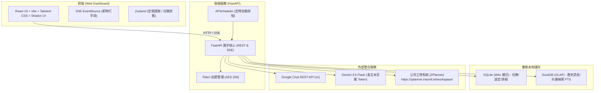
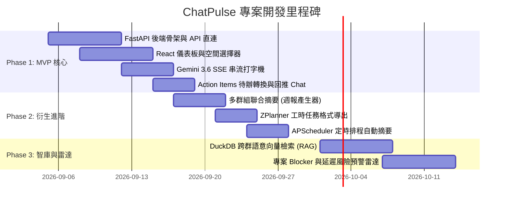

# Google Chat 智慧摘要與管理儀表板 (ChatPulse) 系統需求規格書

> **文件版本**：v1.0  
> **規劃作者**：Antigravity Multi-Agent Architecture Team (Backend Architect, UI/UX Designer, Product Manager)  
> **專案代號**：ChatPulse  

---

## Executive Summary (專案緣起與願景)

在身兼多專案的研發團隊中，工程師、PM 與主管平均加入 30 到 100+ 個 Google Chat 群組。資訊嚴重碎片化導致：
1. **Context Switching 代價高昂**：開會或休假後爬梳各群組對話耗損大量生產力。
2. **決策與 Action Items 散落**：聊天室承諾的待辦事項缺乏追蹤，容易淪為死角。
3. **知識孤島與重複踩坑**：不同專案群組重複討論相同的技術架構或客戶排障問題。

**ChatPulse** 是一個專為工程團隊打造的 **「Google Chat 智慧儀表板」**。透過視覺化 Web 介面，讓使用者隨選群組、自訂範圍，秒級產出結構化 AI 摘要與待辦清單，並進一步延伸為跨群週報產生器、專案風險雷達與技術問答 RAG 智庫。

---

## 一、 5 大破壞性衍生應用場景 (Extended Use Cases)

經過產品經理與業務情境評估，本儀表板除了「單一群組摘要」之外，具備以下 5 個極高商業效益的延伸場景：

| 場景 | 核心痛點 | 解決方案與商業價值 |
| :--- | :--- | :--- |
| **1. 跨群週報與 Standup 一鍵生成器** | PM / 主管每週五耗費數小時跨十幾個專案群組手動拼湊週報 | 勾選 5~10 個目標專案群組，一鍵萃取本週進度、關鍵里程碑與下週計畫，自動生成標準週報 Markdown。每人每週省下 1.5~2 小時。 |
| **2. 跨群組技術踩坑與架構 RAG 智庫** | 某專案已解決過的 WAF 攔截或框架 Bug，另一個專案又重新踩坑 | 建立對話向量索引 (RAG)，在儀表板搜尋「Citrix WAF JSON 深度限制」，立即跨群找出歷史解決紀錄與代碼片段。 |
| **3. 專案延遲與 Blocker 預警雷達** | 客戶抱怨或技術瓶頸停滯多天，主管卻在死線前才得知 | AI 定時巡檢群組訊息，針對情緒指標與停滯關鍵字（如「卡關」、「等客戶回」、「沒人回」）自動發起高風險預警。 |
| **4. 離職與新進人員交接脈絡速成包** | 新人接手老專案，面對數千則歷史訊息不知從何看起 | 一鍵針對特定專案 Space 產出「專案歷史全景圖」：核心 Stakeholder 清單、關鍵架構決策紀錄 (ADR) 與未結技術債。 |
| **5. 重大故障 (Incident) 戰情模式與復盤** | 線上重大事故發生時，對話雜亂無章，事後 Post-mortem 難以還原時間線 | 一鍵切換「戰情模式」，自動依時間序抓取各方排查紀錄，精確重組故障時間線 (Incident Timeline) 與根本原因推論。 |

---

## 二、 系統架構與技術選型 (System Architecture)



### 關鍵技術決策：
1. **後端與託管整合架構**：**FastAPI (Python 3.11+)**。
   - 原生支援 Python 異步非同步處理，直接託管前端 Web 靜態頁面，一鍵啟動無需分開架設。
   - 內建 Server-Sent Events (SSE)，支援 Gemini 實時串流打字輸出。
   - 加入 **Spaces 列表記憶體快取 (5 分鐘 TTL)**，讓 100+ 群組秒級載入，支援手動強制刷新。
2. **AI 分析引擎**：**Gemini 3.6 Flash**。
   - 具備 100 萬 Token 超長上下文窗口，抓取 100~500 筆對話毫不吃力。
   - 極低延遲與低成本，平均 1~2 秒即可開始串流生成。
3. **儲存與工時聯動 (雙軌設計 + ZPlanner 格式化)**：
   - **SQLite**：儲存儀表板使用者偏好、釘選群組、自訂排程與加密 Token。
   - **DuckDB**：作為本地高性能力量分析引擎，存放抓取的對話全文與向量 Embeddings。
   - **ZPlanner 格式化器**：前端自動提取 Action Items，轉換為公司自研工時系統 `ZPlanner` 格式並提供一鍵複製。

---

## 三、 前端介面與互動設計 (UI/UX Design)

### 1. 介面視覺風格
- **風格定位**：**Linear / Vercel 風格**（現代極簡工程師美學）。
- **色調**：預設曜石黑深色主題 (Dark Mode)，搭配微邊框擬物與低飽和狀態標籤。
- **佈局架構**：採用現代高效 **三欄式工作台 (Three-Column Workbench)**。

```text
+----------------------+------------------------------------+-----------------------+
| 左欄：空間導覽與篩選 | 中欄：動態摘要與待辦工作台         | 右欄：參數調校與數據  |
+----------------------+------------------------------------+-----------------------+
| [🔍 搜尋 100+ 群組]  | 標題：🤖【對話智慧摘要｜1.BU2-PG】 | [抓取則數滑桿: 100筆] |
| ⭐️ 我的最愛 (釘選)   | [ 即時串流打字機渲染中... ]        | [摘要風格: 技術/進度] |
| • 1.BU2-PG           |                                    | --------------------- |
| • 0.暫存             | 📌 核心討論主題 (Markdown)         | 📊 群組健康度與熱力圖 |
| • 北市府新案         | 🤝 共識與決議                      | 24hr 發言頻率圖表     |
| 📁 專案分類標籤      | 🎯 Action Items (可勾選 Checkbox)  |                       |
| [公部門] [金融] [內部] |   ☑️ [PG組] 調整 WAF JSON Payload  | 🚀 快捷動作           |
|                      |   ⬜ [維運] 部署 TomcatLog 壓縮    | • [一鍵回推 GoogleChat]|
| [☑️ 啟用多群組模式]   |                                    | • [匯出 Markdown/PDF] |
|                      | [ 編輯 Markdown ] [ 匯出至 ZPlanner]| • [建立定時排程]      |
+----------------------+------------------------------------+-----------------------+
```

### 4.3 核心互動特性
1. **群組篩選器**：
   - 支援 100+ 群組快速模糊搜尋與標籤分類（公部門/金融案/內部維運）。
   - 支援「我的最愛 (Starred)」釘選常用群組。
   - **多選群組比較模式**：可勾選多個 Space 同時提交分析，一鍵產生跨專案進度總結。
2. **即時串流打字機與雙向編輯**：
   - 串接 SSE 即時逐字輸出，解決長時間等待的焦慮感。
   - 摘要完成後可切換為行內 Markdown 編輯器，手動增修微調。
3. **Action Items 智慧互動轉換**：
   - 自動將文字待辦識別轉為可勾選 Checkbox。
   - 支援一鍵複製工時與待辦格式，預留對接自研工時系統 `ZPlanner` (https://zplanner.intumit.tw/workspace/)。
4. **一鍵雙向回推**：
   - 審閱滿意後，點擊「推播回 Google Chat」，Bot 自動將摘要送回該群組。

---

## 四、 核心 API 規格設計 (REST & SSE)

| HTTP 方法 | 端點 (Endpoint) | 功能說明 | 備註 |
| :--- | :--- | :--- | :--- |
| `GET` | `/api/v1/spaces` | 取得已加入的空間列表（支援快取與名稱搜尋） | 包含 spaceType, id, displayName |
| `GET` | `/api/v1/spaces/{space_id}/messages` | 分頁抓取指定空間歷史訊息 | 支援 `limit` (預設 30, 上限 500) |
| `POST` | `/api/v1/spaces/{space_id}/summarize/stream` | **觸發 Gemini 對話摘要 (SSE 串流)** | 回傳 `text/event-stream` 打字效果 |
| `POST` | `/api/v1/summarize/multi-spaces` | 跨群組聯合摘要 (週報模式) | 支援同時傳入多個 `space_ids` |
| `POST` | `/api/v1/spaces/{space_id}/publish` | 將編輯後的摘要推播回 Google Chat | Body: `{ "text": "...", "cardsV2": ... }` |
| `POST` | `/api/v1/action-items/export-zplanner` | 將 Action Items 格式化導出為 ZPlanner 工時/任務項目 | Body: `{ "items": ["..."] }` |
| `GET/POST`| `/api/v1/schedules` | 定時排程管理 (每日 Standup / 週五週報) | Body: `{ "cron": "0 18 * * 5", "space_id": "..." }` |

---

## 五、 實施計畫與優先級 (MoSCoW 路線圖)



### 優先級清單 (MoSCoW)：

- **Must Have (MVP 第一階段，立即實作)**：
  - [x] Google Chat API 憑證與空間讀取 (已驗證)
  - [x] Gemini 3.6 長文本對話深度摘要邏輯 (已驗證)
  - [ ] Web 儀表板介面 (群組列表搜尋、自訂筆數滑桿、深色模式)
  - [ ] SSE 實時打字機串流輸出
  - [ ] Action Items 待辦勾選與一鍵推播回 Chat
- **Should Have (第二階段)**：
  - 跨群組多選聯合週報產生器
  - Action Items 格式化匯出至公司自研工時系統 `ZPlanner` (https://zplanner.intumit.tw/workspace/)
  - APScheduler 每日/每週自動排程推播
- **Could Have (第三階段)**：
  - DuckDB 向量搜尋跨群技術知識庫 (RAG)
  - 專案風險與 Blocker 預警雷達
  - Incident 戰情模式時間線還原
- **Won't Have (暫不考慮)**：
  - 未經授權的聊天室自動發言/閒聊機器人、員工發言量考核功能。
